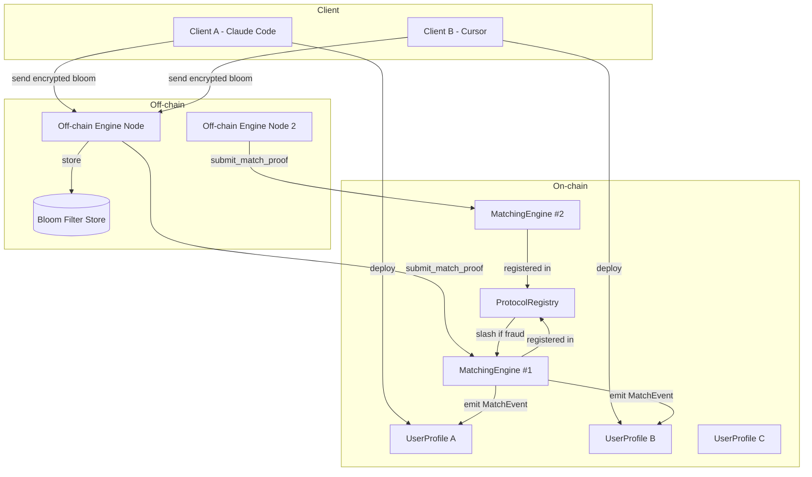
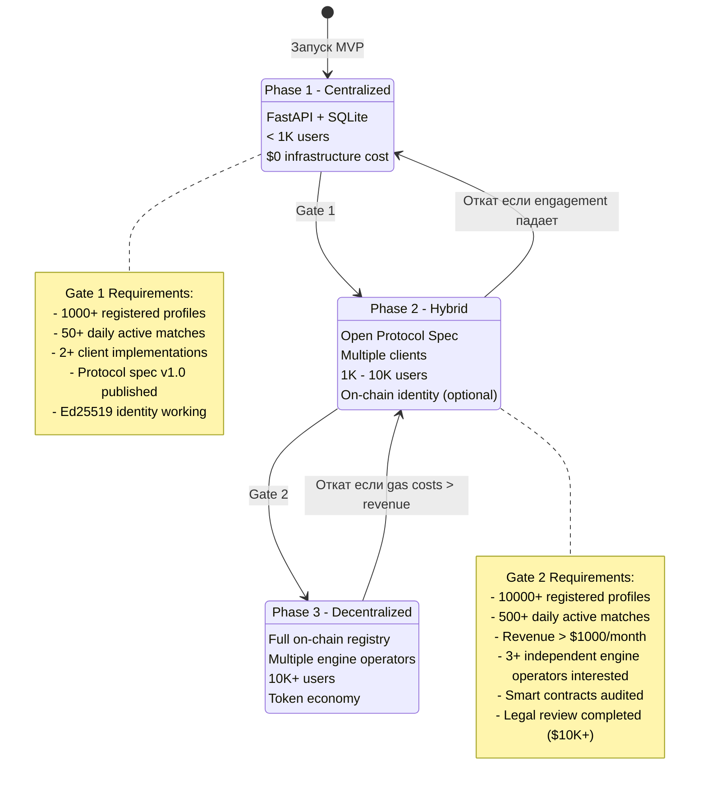
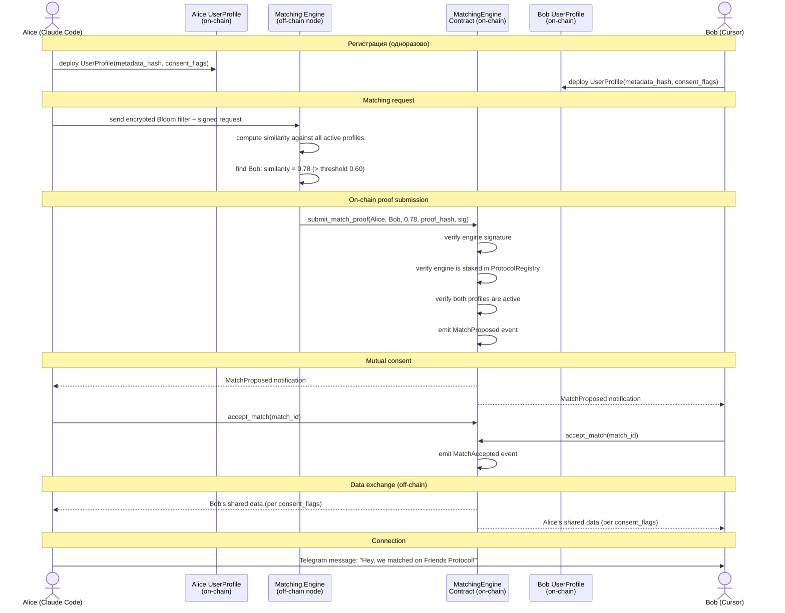
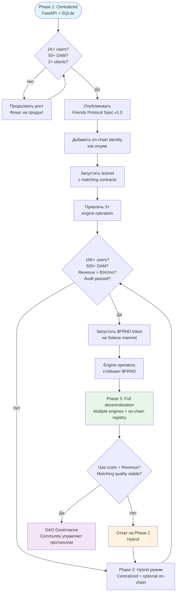
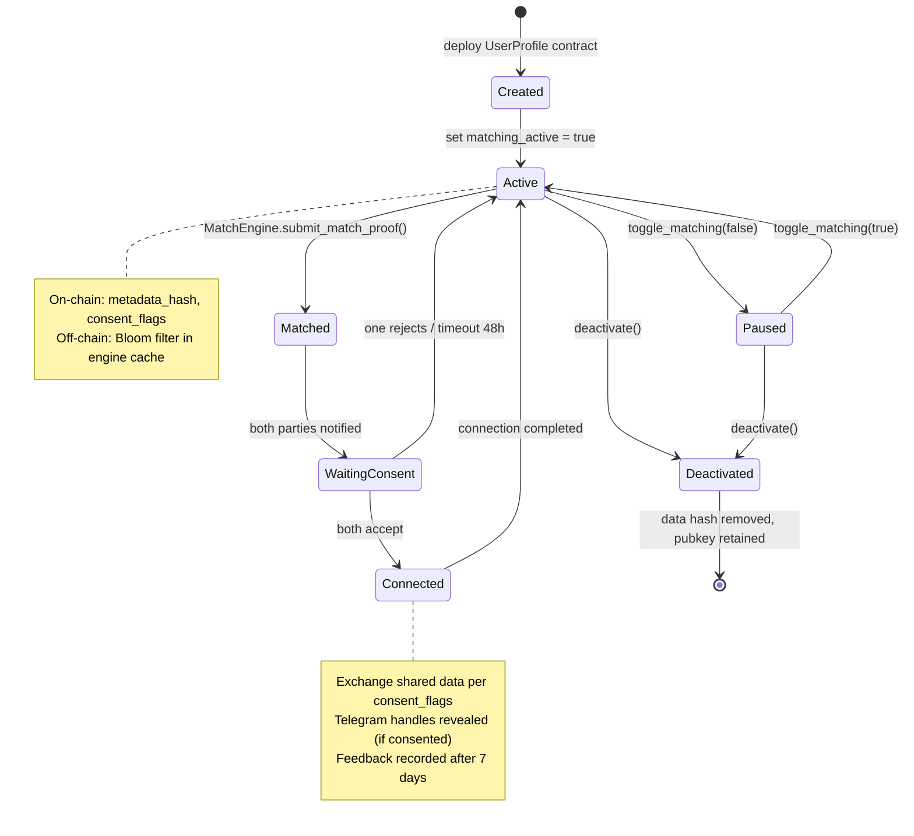

# Friends Protocol — Blockchain Roadmap

> Статус: DRAFT v0.1
> Дата: 2026-04-08
> Авторы: Тим Зинин, Денис Говорунов
> Назначение: внутренний документ для обсуждения архитектуры децентрализации

---

## 1. Анализ блокчейн-идей из разговора

### Идея #12: Децентрализация как принцип

**Цитата:**
> *"был бы классно сделать чтобы это было децентрализованная технология"*

**Экспертная оценка:** Правильная интуиция. Matching protocol, где данные пользователя не покидают его устройство, естественно тяготеет к децентрализации. Но "классно" -- не аргумент для архитектурного решения. Децентрализация нужна когда:
1. Нет доверия к единому оператору (цензура, злоупотребление данными)
2. Нужна permissionless экосистема (любой может поднять ноду)
3. Нужна immutability (результаты матчинга нельзя подделать)

На этапе <1K пользователей ни одно из этих условий не выполняется. FastAPI на Contabo решает все задачи за $0.

**Вердикт:** Верный стратегический вектор, но преждевременен для MVP.

---

### Идея #16: Блокчейн или P2P сеть

**Цитата:**
> *"это либо блокчейн либо это какой-то ну или какая-то своей пи-ту-пи сеть"*

**Экспертная оценка:**

| Вариант | Плюсы | Минусы | Прецеденты |
|---------|-------|--------|------------|
| **Blockchain** | Стандартизированный консенсус, smart contracts, existing tooling | Gas costs на matching, complexity, crypto-audience bias | Lens Protocol (<100K), Farcaster (потерял momentum) |
| **P2P mesh** | Zero infrastructure costs, true decentralization | NAT traversal, discoverability, offline nodes = потеря данных | Briar (<10K), Scuttlebutt (<5K) |
| **Centralized** | Быстро, дешево, отлаживается за часы | Single point of failure, trust required | Tinder (75M MAU), LinkedIn (1B) |

Mesh правильно отвергнут в самом разговоре ("мэш мы заебемся это делать"). P2P social apps исторически не масштабировались: Briar, Scuttlebutt, Aether -- все <10K пользователей.

Блокчейн решает конкретную задачу: **verifiable identity + permissionless matching + censorship resistance**. Вопрос -- нужно ли это пользователям на старте. Спойлер: нет.

**Вердикт:** Блокчейн > P2P. Но оба варианта -- Phase 3+.

---

### Идея #25: Смарт-контракт на каждого пользователя

**Цитата:**
> *"человек создает на себя смарт-контракт, публикует его, эти контракты матчатся... движок который нажимаешь я хочу и эта технология ищет тебя"*

**Экспертная оценка:** Красивая метафора, которая транслируется в конкретную архитектуру:

```
User → deploys UserProfile contract → contract stores:
  - Bloom filter (encrypted or hashed)
  - Public key (Ed25519 → on-chain identity)
  - Consent flags (what data to share on match)
  - Matching preferences (city, topic weights)

MatchingEngine contract:
  - Reads all UserProfile contracts
  - Computes similarity (off-chain compute, on-chain verification)
  - Emits Match events
  - Stores mutual consent proofs
```

**Реалистичная стоимость:**

| Операция | Solana | Base (Ethereum L2) | Sui |
|----------|--------|---------------------|-----|
| Deploy UserProfile | $0.002 | $0.01-0.05 | $0.001 |
| Update Bloom filter | $0.0005 | $0.005-0.02 | $0.0003 |
| Match query (on-chain) | $0.001/query | $0.01-0.05/query | $0.0005/query |
| **10K users, 100 queries/day** | **$3/day** | **$50-250/day** | **$1.5/day** |

При 10K пользователей и 100 match-запросах в день -- Solana/Sui экономически терпимы, Base дороговат для тяжелого matching.

Но есть фундаментальная проблема: **Bloom filter matching on-chain = вычислительно тяжело**. Jaccard similarity между двумя Bloom фильтрами (1024 бит каждый) = побитовые AND/OR + деление. На EVM это ~50K gas. На Solana/Sui -- дешевле, но всё равно не бесплатно. При N пользователей matching одного запроса = O(N) сравнений.

**Решение:** Off-chain compute + on-chain verification (см. раздел 3).

**Вердикт:** Архитектурно осмысленная идея. Реализуема на Solana/Sui. Стоимость приемлема при >5K пользователей. Требует гибридной модели (off-chain compute).

---

### Идея #26: Friends Protocol как универсальный стандарт

**Цитата:**
> *"можно это назвать MCP сервером или каким-то универсальным friends протоколом"*

**Экспертная оценка:** Самая сильная идея. Friends Protocol = открытая спецификация, которую может реализовать любой клиент:

- Claude Code skill
- Cursor extension
- Windsurf plugin
- Standalone CLI
- Mobile app (Phase 4)

Протокол определяет:
1. **Формат профиля** (Bloom filter parameters, metadata schema)
2. **Matching API** (request/response format, similarity threshold)
3. **Identity** (Ed25519 keypair, on-chain registration)
4. **Consent** (granular permissions, revocation)

Это NOT зависит от блокчейна. Протокол работает и с централизованным сервером, и с блокчейном. Блокчейн добавляет:
- Permissionless registry (любой может зарегистрировать профиль)
- Immutable consent records (пользователь контролирует данные)
- Verifiable matching (результаты нельзя подделать)

**Вердикт:** Friends Protocol spec -- приоритет Phase 2. Блокчейн -- одна из возможных реализаций транспортного слоя.

---

### Идея #27: Начать centralized, потом blockchain

**Цитата:**
> *"начать с централизованного решения которое просто висит на серваке... а потом мы туда уже добавляем блокчейн следующим шагом"*

**Экспертная оценка:** Единственная правильная стратегия. Исторически:

| Проект | Старт | Децентрализация | Результат |
|--------|-------|-----------------|-----------|
| Bitcoin | 1 нода (Satoshi) | Постепенная | Работает |
| Ethereum | Foundation + centralized testnets | Постепенная | Работает |
| Farcaster | Centralized hub | Hubs network | Потерял momentum, <50K DAU |
| Lens Protocol | Polygon contracts day 1 | С рождения | Нишевый, crypto-only audience |
| Mastodon | Federated from day 1 | С рождения | 8M accounts, <1M MAU |

**Паттерн:** Проекты, которые начинают с децентрализации, привлекают только crypto/decentralization энтузиастов. Проекты, которые начинают с ценности и децентрализуются потом, имеют шанс на mainstream.

**Вердикт:** Подтверждено. Phase 1 = FastAPI. Phase 2 = open protocol. Phase 3 = blockchain transport.

---

### Идея #33: Crowdfunding / Proof of Stake

**Цитата:**
> *"в момент когда сервер ляжет мы объявим рейс... давайте-ка вместе скинемся... порфа встайк"*

**Экспертная оценка:** Смешение двух разных концепций:

1. **Crowdfunding инфраструктуры** -- пользователи скидываются на сервер. Это работает для open-source (Wikipedia, Signal), но требует >100K активных пользователей для sustainable funding.

2. **Proof of Stake** -- консенсус-механизм, где валидаторы ставят токены для участия в сети. Решает проблему доверия между незнакомыми нодами, а не проблему фандинга.

Ни то, ни другое не нужно при <10K пользователей. Contabo VPS = $10/месяц. Если продукт работает и растет, монетизация через event matching ($2/participant) покрывает инфраструктуру.

PoS становится релевантным если Friends Protocol станет по-настоящему decentralized network с node operators. Тогда staking = экономический стимул для запуска нод.

**Вердикт:** Crowdfunding = не нужен (дешевая инфраструктура). PoS = Phase 3+ only, когда сеть нод реально существует.

---

## 2. Сравнение блокчейнов

### Критерии для Friends Protocol

Friends Protocol предъявляет специфические требования:
- **Низкая стоимость записи** (deploy profile, update Bloom filter)
- **Быстрый finality** (matching должен происходить за секунды, не минуты)
- **Compute capability** (Jaccard similarity или хотя бы верификация результатов)
- **Developer experience** (малая команда, нужен хороший tooling)
- **Mainstream accessibility** (кошелек не должен быть барьером)

### Сравнительная таблица

| Параметр | **Solana** | **Base (Ethereum L2)** | **Sui** |
|----------|-----------|------------------------|---------|
| **TPS** | ~4,000 (реально) | ~100-200 | ~10,000+ (теория), ~300 (реально) |
| **Finality** | ~400ms | ~2 sec (L2) + 12 min (L1 settlement) | ~500ms |
| **Стоимость tx** | $0.0002-0.001 | $0.001-0.05 | $0.0001-0.001 |
| **Deploy контракта** | $0.002 | $0.01-0.10 | $0.001 |
| **Язык контрактов** | Rust (Anchor framework) | Solidity (EVM) | Move |
| **Compute per tx** | 200K compute units | ~30M gas limit | Flexible (object-centric) |
| **Хранение on-chain** | $0.007/KB (rent) | $20-100/KB (calldata) | $0.001-0.01/KB (object storage) |
| **Wallet UX** | Phantom, Solflare | MetaMask, Coinbase Wallet | Sui Wallet |
| **Account abstraction** | Нативное (Solana Mobile) | ERC-4337 (сложнее) | zkLogin (Google/Apple ID!) |
| **Экосистема DeSocial** | Dialect, Backpack | Farcaster (на OP, но совместим), Lens | Пока пустая |
| **DevEx tooling** | Anchor, Solana Playground | Hardhat, Foundry, RemixIDE | Sui Move, Sui Explorer |
| **Популярность среди разрабов** | Высокая (Rust экосистема) | Очень высокая (EVM = стандарт) | Растущая, Move = нишевый |

### Рекомендация

**Solana -- primary candidate.** Причины:

1. **Стоимость**: самая низкая для операций записи, что критично при deploy контракта на каждого пользователя
2. **Finality**: 400ms = пользователь не замечает задержки
3. **Anchor framework**: хороший DX, типизированные RPC, auto-IDL
4. **Экосистема**: Phantom wallet = 15M+ пользователей, Mobile stack для будущей мобильной версии
5. **Compute**: достаточно для on-chain verification (не matching, но proof verification)

**Sui -- запасной вариант.** Причины:
1. **zkLogin** = авторизация через Google/Apple без crypto wallet. Это убирает главный барьер для mainstream пользователей
2. **Object-centric model** идеально ложится на "контракт на каждого пользователя" (каждый профиль = owned object)
3. Дешевле Solana на хранение

**Base/Arbitrum -- НЕ рекомендуется.** Причины:
1. EVM gas model плохо подходит для частых мелких операций
2. L2 settlement delay добавляет неопределенность
3. На порядок дороже Solana/Sui для нашего use case

---

## 3. On-chain vs Off-chain

### Принцип: "On-chain для доверия, off-chain для вычислений"

Bloom filters пользователей = 1024-4096 бит каждый. Matching = Jaccard similarity = побитовые операции. При N=10K пользователей, один запрос = 10K побитовых сравнений. Это тривиально для сервера (< 1ms), но неподъемно для smart contract (gas cost * 10K = банкротство).

### Что хранить on-chain

| Данные | On-chain? | Обоснование |
|--------|-----------|-------------|
| **Identity (public key)** | Да | Immutable, verifiable, self-sovereign |
| **Consent records** | Да | Пользователь должен иметь cryptographic proof что он дал/отозвал согласие |
| **Matching results (хеш)** | Да | Proof что матч произошел, обе стороны согласились |
| **Profile metadata hash** | Да | Commitment: "я обещаю что мой профиль = hash(X)", без раскрытия X |
| **Protocol version** | Да | Какую версию протокола поддерживает этот профиль |
| **Bloom filter** | **Нет** | Слишком большой (128-512 байт), меняется часто, on-chain хранение = $0.5-5 на пользователя |
| **Raw topic tags** | **Нет** | Приватные данные, никогда не покидают устройство |
| **Similarity scores** | **Нет** | Вычисляются off-chain, on-chain хранится только proof |
| **Telegram handle** | **Нет** | PII, раскрывается only after mutual consent |
| **City, location** | **Нет** | Privacy-sensitive, передается через encrypted channel |

### Гибридная архитектура

```
[Client]                    [Off-chain Layer]              [On-chain Layer]
                                                           
Bloom filter ──────────→ Matching Engine           UserProfile contract
  (encrypted)              (FastAPI server            - pubkey
                            или distributed            - metadata_hash
                            compute nodes)             - consent_flags
                               │                       - protocol_version
                               │                       
                          similarity(A, B)         MatchingEngine contract
                               │                       - verify_match_proof()
                               ↓                       - emit MatchEvent
                          match_proof =            
                          hash(A.bloom, B.bloom,   ProtocolRegistry contract
                               score, timestamp)       - registered nodes
                               │                       - protocol versions
                               └──── submit ─────→     - fee parameters
```

### Proof of Match

Ключевая инновация: matching происходит off-chain (быстро, дешево), но результат верифицируется on-chain:

1. Off-chain engine вычисляет `similarity(A, B) = 0.73`
2. Engine генерирует `match_proof = hash(A.bloom_commitment, B.bloom_commitment, score, timestamp, engine_signature)`
3. Proof записывается on-chain
4. Любая сторона может оспорить результат (fraud proof) -- но на практике это не нужно для social app

Это паттерн **optimistic execution**: доверяем off-chain результату, наказываем за мошенничество.

---

## 4. Архитектура смарт-контрактов

### 4.1 UserProfile Contract

```
┌─────────────────────────────────┐
│         UserProfile             │
├─────────────────────────────────┤
│ owner: Pubkey                   │  // Ed25519, владелец профиля
│ metadata_hash: [u8; 32]        │  // SHA-256 от Bloom filter
│ protocol_version: u8           │  // версия Friends Protocol
│ created_at: i64                │  // timestamp создания
│ updated_at: i64                │  // timestamp обновления
│ consent_flags: u16             │  // битовая маска: что раскрывать
│ matching_active: bool          │  // участвует ли в matching
│ reputation_score: u16          │  // накопленная репутация
│ total_matches: u32             │  // всего матчей
│ positive_feedback: u32         │  // позитивные отзывы
├─────────────────────────────────┤
│ fn initialize(metadata_hash)   │  // создание профиля
│ fn update_metadata(new_hash)   │  // обновление Bloom filter
│ fn set_consent(flags)          │  // управление consent
│ fn toggle_matching(active)     │  // вкл/выкл matching
│ fn record_feedback(match_id,   │  // обратная связь после матча
│                    positive)   │
│ fn deactivate()                │  // "удаление" профиля
└─────────────────────────────────┘
```

**Consent flags (битовая маска):**
```
bit 0: share_display_name       // показывать имя
bit 1: share_telegram           // показывать TG handle
bit 2: share_city               // показывать город
bit 3: share_topics_summary     // показывать top-5 тем
bit 4: share_match_score        // показывать % совместимости
bit 5: allow_event_matching     // участвовать в event matching
bit 6: allow_b2b_matching       // участвовать в B2B matching
bit 7-15: reserved
```

### 4.2 MatchingEngine Contract

```
┌─────────────────────────────────────┐
│         MatchingEngine              │
├─────────────────────────────────────┤
│ authority: Pubkey                   │  // оператор engine
│ protocol_registry: Pubkey          │  // ссылка на registry
│ total_matches: u64                 │  // всего матчей в системе
│ fee_per_match: u64                 │  // комиссия (lamports/MIST)
│ min_similarity: u16               │  // порог (0-10000 = 0-100%)
├─────────────────────────────────────┤
│ fn submit_match_proof(             │  // off-chain engine подает proof
│     user_a: Pubkey,                │
│     user_b: Pubkey,                │
│     similarity_score: u16,         │
│     proof_hash: [u8; 32],          │
│     engine_signature: [u8; 64]     │
│ )                                  │
│                                    │
│ fn accept_match(match_id)          │  // user принимает матч
│ fn reject_match(match_id)          │  // user отклоняет матч
│ fn dispute_match(match_id, proof)  │  // fraud proof (Phase 4)
│ fn update_fee(new_fee)             │  // governance: изменить комиссию
│ fn update_threshold(min_sim)       │  // governance: порог similarity
└─────────────────────────────────────┘
```

**Match lifecycle:**
```
PROPOSED → PENDING_A → PENDING_B → ACCEPTED → COMPLETED
                                 ↘ REJECTED
         ↘ EXPIRED (48h timeout)
```

### 4.3 ProtocolRegistry Contract

```
┌──────────────────────────────────────┐
│         ProtocolRegistry             │
├──────────────────────────────────────┤
│ admin: Pubkey                        │  // multisig governance
│ current_version: u8                  │  // текущая версия протокола
│ registered_engines: Vec<EngineMeta>  │  // зарегистрированные engines
│ registered_users: u64                │  // всего профилей
│ protocol_fee_bps: u16               │  // комиссия протокола (basis points)
│ treasury: Pubkey                     │  // казначейство
├──────────────────────────────────────┤
│ fn register_engine(engine_pubkey,    │  // регистрация нового engine
│                    stake_amount)     │
│ fn deregister_engine(engine_pubkey)  │  // удаление engine
│ fn slash_engine(engine_pubkey,       │  // наказание за fraud
│                 evidence)            │
│ fn update_protocol(new_version)      │  // обновление протокола
│ fn withdraw_fees(amount)             │  // вывод комиссий
│ fn set_bloom_params(size, hashes)    │  // параметры Bloom filter
└──────────────────────────────────────┘

EngineMeta:
  pubkey: Pubkey
  stake: u64            // заложенные токены
  uptime_score: u16     // SLA compliance
  total_matches: u64
  disputes_lost: u32
  registered_at: i64
```

### Взаимодействие контрактов



---

## 5. Токеномика

### Нужен ли токен?

**Честный ответ: на Phase 1-2 -- нет.** Токен добавляет:
- Регуляторные риски (securities law в US, EU)
- Привлекает спекулянтов вместо пользователей
- Усложняет UX (нужен кошелек, нужно купить токен)

**Когда токен становится необходимым:**
- Есть несколько независимых matching engines (нужен staking для доверия)
- Нужно governance (голосование за параметры протокола)
- Network effects требуют экономического стимула

### Модель токена (Phase 3+)

**Название:** $FRND (Friends Protocol Token)

**Тип:** Utility token (НЕ security). Используется для:

| Функция | Механизм | Кто платит |
|---------|----------|-----------|
| **Protocol fees** | Каждый матч = micro-fee в $FRND | Пользователь или engine |
| **Engine staking** | Node operator ставит $FRND для запуска engine | Engine operator |
| **Slashing** | Fraud proof = потеря stake | Нечестный engine operator |
| **Governance** | Голосование за параметры (fee, threshold, Bloom params) | Token holders |
| **Premium features** | Event matching, B2B matching, priority queue | Пользователь/организатор |

### Token Flow

```
User pays fee ──→ Protocol Treasury (30%)
                  Engine Operator (60%)
                  Governance Fund (10%)

Engine stakes ──→ Locked in ProtocolRegistry
              ──→ Slashed on fraud
              ──→ Returned on deregistration (after cooldown)
```

### Распределение (initial)

| Аллокация | % | Vesting |
|-----------|---|---------|
| Community и airdrops | 40% | По мере роста сети |
| Team (Тим + Денис) | 20% | 2-year cliff, 4-year linear |
| Engine operators incentives | 20% | По мере подключения нод |
| Treasury и development | 15% | Governance-controlled |
| Early contributors | 5% | 1-year cliff |

### Anti-speculation меры

1. **Нет pre-sale и ICO.** Токен появляется только когда протокол работает.
2. **Fee burning:** 10% от каждой комиссии сжигается (дефляция).
3. **Usage-based distribution:** Токены раздаются за реальное использование (создание профиля, успешные матчи), не за покупку.
4. **Maximum stake cap:** Engine operator не может застейкать больше X% от total supply (предотвращает централизацию).

---

## 6. Миграционные Gates

### Принцип: каждый переход обусловлен конкретными метриками, а не календарем



### Phase 1: Centralized (текущая --> 1K users)

**Архитектура:**
- FastAPI server на Contabo VPS 30
- SQLite database
- REST API для skill --> server
- Ed25519 keypair на клиенте
- D3.js граф в браузере

**Что строим для будущей миграции:**
- API design = Friends Protocol v0.1 (endpoint structure, request/response format)
- Ed25519 identity = будущий on-chain pubkey
- Bloom filter params = будущий on-chain commitment
- Consent model = будущий on-chain consent contract

**Gate 1 checklist:**
- [ ] 1000+ зарегистрированных профилей
- [ ] 50+ daily active matches (DAM)
- [ ] NPS > 30 (пользователи реально находят интересных людей)
- [ ] 2+ client implementations (Claude Code + хотя бы Cursor/Windsurf)
- [ ] Friends Protocol spec v1.0 опубликован
- [ ] Revenue path validated (event matching работает)
- [ ] Ed25519 identity работает надежно (>99.9% uptime)

### Phase 2: Hybrid (1K --> 10K users)

**Архитектура:**
- Centralized matching engine (FastAPI, Postgres)
- On-chain identity registry (optional) -- пользователь может зарегистрировать pubkey on-chain
- On-chain consent proofs (optional) -- immutable consent records
- Off-chain matching, on-chain match proof verification
- Multiple client support через open protocol

**Миграция данных:**
1. Все существующие Ed25519 ключи совместимы с Solana (Ed25519 = native Solana keypair)
2. Пользователь вызывает `register_onchain()` --> deploy UserProfile contract с existing pubkey
3. Bloom filter остается off-chain, metadata_hash записывается on-chain
4. Matching продолжает работать через centralized engine
5. Match proofs начинают записываться on-chain (optional, для early adopters)

**Gate 2 checklist:**
- [ ] 10000+ зарегистрированных профилей
- [ ] 500+ DAM
- [ ] Revenue > $1000/месяц (event matching + B2B)
- [ ] 3+ независимых оператора готовы запустить matching engine
- [ ] Smart contracts аудит пройден (минимум 1 независимый аудитор)
- [ ] Legal review для токена завершен
- [ ] Testnet работает >3 месяцев без critical bugs
- [ ] Community governance proposal accepted

### Phase 3: Decentralized (10K+ users)

**Архитектура:**
- Multiple independent matching engines (staked operators)
- Full on-chain protocol registry
- On-chain identity mandatory для matching
- $FRND token для fees, staking, governance
- Fraud proofs для оспаривания результатов matching
- DAO governance для параметров протокола

**Что остается off-chain навсегда:**
- Bloom filter computation (client-side)
- Actual matching computation (engine nodes)
- Topic extraction (client-side)
- Telegram communication (after match)
- Raw user data (never leaves device)

---

## 7. Диаграммы

### Sequence Diagram: On-chain Matching (Phase 3)



### Flowchart: Миграция centralized --> decentralized



### State Diagram: UserProfile Lifecycle



---

## 8. Риски и митигация

| Риск | Вероятность | Влияние | Митигация |
|------|-------------|---------|-----------|
| Blockchain отпугнет mainstream пользователей | Высокая | Высокое | Блокчейн = internal infrastructure, НИКОГДА не упоминать в UX. Пользователь видит "Friends Protocol", не "Solana" |
| Gas costs превысят revenue | Средняя | Высокое | Off-chain matching + on-chain proof only. Rollback gate в Phase 3 |
| Регуляторные проблемы с токеном | Средняя | Критическое | Legal review ПЕРЕД запуском токена. Utility token design. Без ICO/pre-sale |
| Smart contract vulnerability | Средняя | Критическое | Audit перед mainnet. Bug bounty program. Upgradeable proxy pattern |
| Нет спроса на децентрализацию | Высокая | Среднее | Gate-based migration: не переходим пока нет доказанного спроса. Centralized version остается рабочей |
| Bloom filter on-chain = дорого | Высокая | Среднее | Bloom filter ВСЕГДА off-chain. On-chain только hash (32 bytes) |
| Centralization в engine operators | Низкая | Высокое | Stake cap per operator. Slashing за collusion. Minimum 3 operators для Phase 3 |

---

## 9. Ближайшие действия

### Phase 1 (сейчас)

Блокчейн-специфичные задачи которые стоит делать уже сейчас:

1. **Ed25519 keypair** -- уже запланирован в SDD. Этот же ключ станет Solana keypair.
2. **API design** -- проектировать REST API как будущий Friends Protocol spec. Версионирование, стандартные форматы.
3. **Bloom filter commitment** -- хранить `SHA-256(bloom_filter)` на сервере. Это будущий `metadata_hash` on-chain.
4. **Consent model** -- битовая маска consent flags. Совместима с on-chain representation.

### НЕ делать сейчас

- Писать smart contracts
- Разрабатывать токеномику детально
- Интегрировать Solana SDK
- Упоминать блокчейн в любых публичных материалах
- Планировать token launch

---

## 10. Заключение

Децентрализация Friends Protocol -- это **стратегическая цель**, а не **тактическое решение**. Путь:

```
Ценный продукт → Доказанный спрос → Открытый протокол → Блокчейн инфраструктура → Токен экономика → DAO governance
```

Каждый шаг обусловлен метриками, а не амбициями. Если продукт не нужен людям централизованно -- он не станет нужен от добавления блокчейна. Если нужен -- блокчейн сделает его устойчивым к цензуре, дает пользователям контроль над данными и создает экономические стимулы для операторов инфраструктуры.

Solana = primary blockchain candidate. Ed25519 совместимость с текущей архитектурой = zero migration cost для identity layer. Off-chain matching + on-chain verification = экономически жизнеспособная модель.
