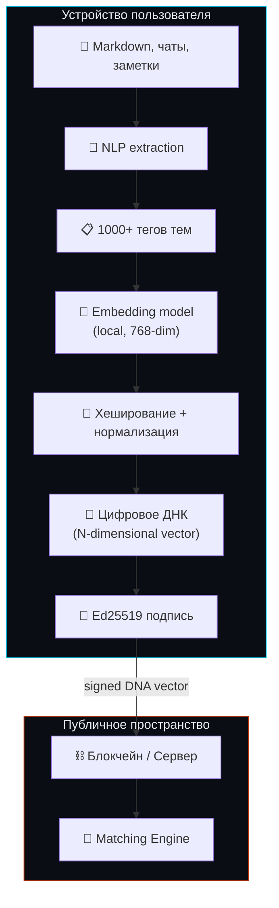
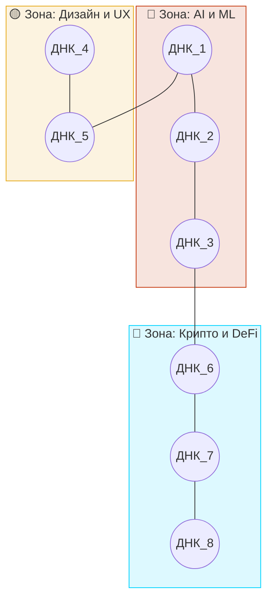
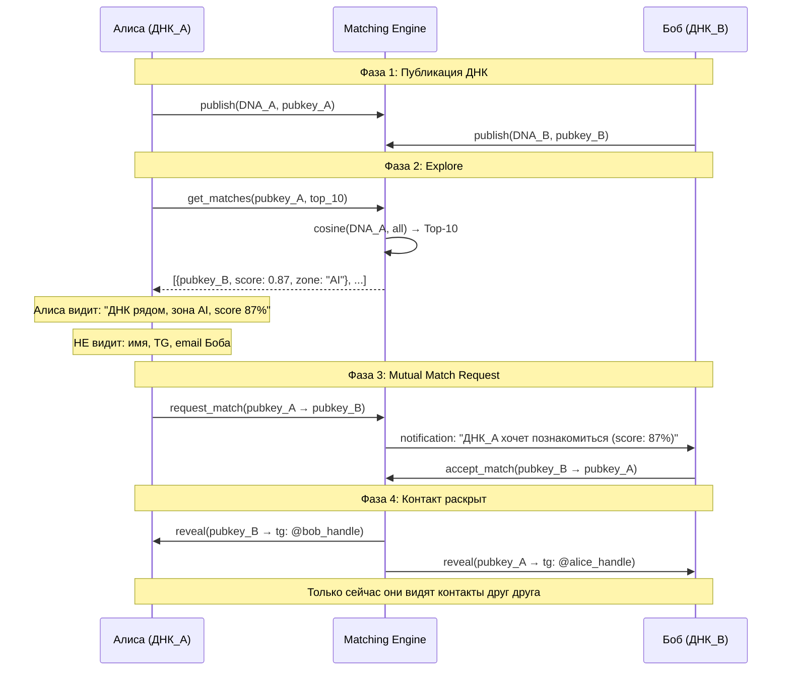

# Цифровое ДНК — Концепция и архитектура

> Версия: 1.0 | Дата: 2026-04-09
> Источник: Standard Recording 11 (брейндамп Дениса Говорунова)
> Статус: Концепция для обсуждения

---

## 1. Что такое Цифровое ДНК

> *"Пользователь на своей стороне через скилл шифрует данные, но на выходе мы получаем некий миллион параметров, миллиард параметров. Некий очень большой набор параметров, по которому дальше можем пользователя оценивать и матчить."* — Денис

**Цифровое ДНК** — это высокоразмерный вектор параметров, который описывает интеллектуальный профиль человека. Генерируется на устройстве пользователя из его файлов, переписок и заметок. Как биологическое ДНК определяет физические характеристики, цифровое ДНК определяет "интеллектуальные характеристики" — интересы, знания, паттерны мышления.

### Ключевые свойства

| Свойство | Описание |
|----------|---------|
| **Локальная генерация** | Создаётся полностью на устройстве пользователя |
| **Необратимость** | Нельзя восстановить исходные данные из ДНК |
| **Публичность** | ДНК может быть опубликовано (в блокчейн или на сервер) |
| **Сравнимость** | Два ДНК можно сравнить и определить "расстояние" между людьми |
| **Анонимность** | ДНК не содержит читаемой информации о человеке |

### Аналогия с биологией

```
Биологическое ДНК:
  Клетки → 3 млрд пар оснований → определяет физические характеристики
  Публикация генома ≠ раскрытие личности (без привязки к имени)

Цифровое ДНК:
  Файлы → N параметров (1K...1M) → определяет интеллектуальные характеристики
  Публикация вектора ≠ раскрытие личности (без привязки к контактам)
```

## 2. Архитектура генерации



### Размерность ДНК

| Подход | Размер | Точность | Privacy | Фаза |
|--------|--------|----------|---------|------|
| Bloom filter (текущий) | 1024 бит (128 байт) | Средняя | Высокая | MVP |
| Dense embedding (384-dim) | 384 × float32 = 1.5 KB | Высокая | Средняя (инвертируемы) | Phase 2 |
| Large embedding (768-dim) | 768 × float32 = 3 KB | Очень высокая | Средняя | Phase 2 |
| "Миллион параметров" (Денис) | 1M × float16 = 2 MB | Максимальная | Низкая (без ZK) | Phase 3+ |
| ZK-encrypted embedding | 768-dim + ZK-proof | Высокая | Максимальная | Phase 4 |

> **Решение для MVP:** Bloom filter 1024 бит — достаточно для базового матчинга, полностью необратим.
> **Решение для Phase 2:** Dense embedding 768-dim с differential privacy noise — более точный матчинг.
> **Видение Дениса (Phase 3+):** Высокоразмерный вектор с ZK-защитой.

## 3. Что ДНК "видит" (белки)

> *"Люди видели условно некие белки, но их расшифровка была бы ультрасложной и неоправданной каждого отдельно взятого."* — Денис

Каждый "белок" — это одно измерение в пространстве ДНК. Пример:

| Измерение (белок) | Что кодирует | Значение 0.0 | Значение 1.0 |
|-------------------|-------------|-------------|-------------|
| dim_042 | Интерес к распределённым системам | Нет интереса | Глубокая экспертиза |
| dim_117 | Творческое мышление | Аналитик | Креативщик |
| dim_283 | Технический уровень | Начинающий | Эксперт |
| dim_451 | Социальная активность | Интроверт | Экстраверт |
| ... | ... | ... | ... |

**Критически важно:** Смысл каждого измерения НЕ фиксирован и НЕ интерпретируем напрямую. Это не анкета — это learned representation. Как в нейросетях: dimension 42 не обязательно значит "distributed systems", это абстрактное направление в пространстве.

## 4. Matching через Цифровое ДНК

### Расстояние между ДНК

```
distance(DNA_A, DNA_B) = 1 - cosine_similarity(A, B)

Или для Bloom filter:
distance(DNA_A, DNA_B) = 1 - jaccard(A, B)
```

### Граф как визуализация

> *"Визуально это представляю как некий Obsidian. Оно всё связано. Наверное, разными клубками. Как поля такие. Зоны."* — Денис



## 5. Mutual Match Protocol

> *"Только тогда они могут увидеть контакты друг друга. Потому что контакты реально на сервере не будут храниться."* — Денис



**Ключевое отличие от текущего SDD:** В текущей версии Telegram handle хранится на сервере и виден всем. В концепции Дениса — **контакты раскрываются ТОЛЬКО при mutual match**.

## 6. Хранение ДНК: сервер vs блокчейн vs локально

> *"Продумай, возможно ли архитектура, когда у нас нет центрального сервера и блокчейн не нужен — когда ДНК хранится у пользователя в телефоне и активизируется по требованию."* — Денис

| Вариант | Плюсы | Минусы | Когда |
|---------|-------|--------|-------|
| **Centralized server** | Простота, быстрый matching | Single point of failure, доверие к оператору | MVP |
| **Блокчейн** | Immutable, trustless, публичный | Стоимость tx, сложность | Phase 3-4 |
| **Локально на устройстве** | Максимальная приватность | Невозможен matching без обмена данными | Не подходит для matching |
| **P2P (gossip protocol)** | Нет центра, resilient | Latency, сложность, discovery | Экспериментально |

**Вердикт:** Чистый "локальный" вариант (ДНК только на телефоне) не работает для matching — нужно как минимум передать ДНК куда-то для сравнения. Оптимальный путь: centralized MVP → blockchain Phase 3.

## 7. Юридический вопрос: ДНК = персональные данные?

> *"Тебе нужно исследовать — можно ли считать, что цифровым ДНК персональные данные или нет? Вызвать юриста по GDPR."* — Денис

*(Исследование в процессе — будет дополнено после завершения юридического анализа)*

### Предварительная оценка

| Закон | Вопрос | Предварительный ответ |
|-------|--------|----------------------|
| GDPR Art. 4(1) | ДНК = personal data? | **Вероятно да**, если привязано к pubkey (идентифицируемое лицо) |
| GDPR Art. 9 | Special category? | **Нет**, если не раскрывает расу, политику, здоровье |
| GDPR Recital 26 | Pseudonymized? | **Да** — ДНК = pseudonymized data (требует доп. информации для идентификации) |
| CCPA | Covered? | **Да** — "inferences drawn from personal information" |

**Стратегия:** Обрабатывать ДНК как **pseudonymized personal data** (GDPR Art. 4(5)). Это даёт больше flexibility чем anonymous data, но требует:
- Consent (opt-in)
- Right to erasure (DELETE)
- Data processing agreement
- Privacy policy

## 8. Отличия от текущего SDD

| Аспект | Текущий SDD (v1.0) | Концепция Дениса (ДНК) |
|--------|--------------------|-----------------------|
| Название данных | "Bloom filter" | "Цифровое ДНК" |
| Размерность | 1024 бит (фиксир.) | 1K → 1M параметров (масштабируемо) |
| Контакты | TG handle хранится на сервере | Контакты раскрываются ТОЛЬКО при mutual match |
| Matching flow | Пользователь видит все матчи сразу | Explore → Request → Accept → Reveal |
| Визуализация | Граф с именами и TG | Граф с анонимными ДНК-нодами ("белки") |
| Маркетинг | "Bloom filter" (технический) | "Цифровое ДНК" (понятная метафора) |

## 9. Рекомендации по обновлению SDD

1. **Переименовать** "Bloom filter profile" → "Цифровое ДНК" в маркетинговых материалах
2. **Добавить Mutual Match** — контакты раскрываются только при взаимном согласии
3. **Расширить модель данных** — от фиксированных 1024 бит к масштабируемому вектору
4. **Обновить UX flow** — Explore (анонимный граф) → Request → Accept → Reveal contacts
5. **"Белки" как UI** — показывать пользователю абстрактные кластеры (зоны), не конкретные теги

## 10. Полная транскрипция Recording 11

> Источник: Standard Recording 11.mp3 (2026-04-08, ~8 мин)
> Участники: Тим Зинин + Денис Говорунов

### [00:00 — 00:16]
> Да блин, ну рано. Сейчас Денис скажет брейндамп и есть вероятность того, что мы что-то испортим. Поэтому нам надо, чтобы ты с этим ещё потом пообщался с нами, поспорил. Денис начинает говорить брейндамп.

### [00:17 — 01:55]
> Отличная идея была с цифровым ДНК. То есть вот если сказать, что цифровое ДНК — пользователь создает на своем устройстве свое цифровое ДНК. То есть никакие персональные данные никуда не улетают. Тебе нужно исследовать, можно ли считать, что цифровым ДНК персональные данные или нет. То есть вот как обозначить цифровое ДНК, что это точно не персональные данные по всем законам и правилам. И вообще основная идея такая, что пользователь на своей стороне через скилл шифрует данные, но на выходе мы получаем некий миллион параметров, миллиард параметров. То есть некий очень большой, прям очень большой набор параметров, по которому дальше можем пользователя оценивать и матчить. То есть условно можем взять эту цифру равную там миллиону. То есть миллион параметров и по каждому из этих параметров оценивается пользователь в сторону каких-то предпочтений. И это нам в будущем позволит строить некий граф принадлежности. То есть мы сможем понять, кто где находится ближе в этом графе и людей вместе таким образом матчить. То есть задача скилла становится — собрав маркдаун файлы, упаковать их в некие сигналы, ну вот некая ДНК. И по этой ДНК мы дальше людей будем соотносить.

### [02:03 — 03:05]
> И возможно рассказать и собственно интродюсить протокол этого цифрового ДНК. То есть вот это самая главная интеллектуальная ценность — это то, каким образом вот эта ДНК будет передаваться и сравниваться друг с другом. [...] Продумай, возможно ли такая архитектура, когда у нас нет центрального сервера и блокчейн не нужен. Когда ДНК хранится у пользователя в телефоне или на компьютере. И оно активизируется только по требованию пользователя.

### [03:05 — 04:00]
> Зачем? Можно же хранить как раз не на телефоне пользователя данные, а передавать информацию о цифровом ДНК — это наше ноу-хау. Видеть их миллионных параметров как раз в блокчейн сразу. И она становится публичным. [...] Если это персональные данные, то нельзя их передавать. — Да это не персональные данные. Мы их разгребаем как хотим.

### [04:46 — 05:27]
> Так, мы видим, что у тебя хранятся публично ник в Телеграме и какие-то публичные данные. Такого быть не должно. Значит, должно быть zero knowledge. И данные должны передаваться в неком шифрованном виде. То есть чтобы не было понятно, кто и что представляет. То есть видимо, чтобы ДНК нельзя было расшифровать. То есть чтобы люди видели условно некие белки, но их расшифровка была бы ультрасложной и неоправданной каждого отдельно взятого. То есть ДНК публичен, но никто не может его расшифровать. Но зато может их совместить и понять... найти адрес этого ДНК.

### [05:27 — 07:06]
> В случае матча направить сообщение одному ДНК и отправить сообщение другому ДНК. И только в случае если они будут согласны... [...] Он тебе выдает десятку мэчей, и клиент может выбрать — вот этому давай повторяем запрос. И этот запрос отправляется другому, и он может принять. Он может принять просто ДНК. И только тогда они могут увидеть контакты друг друга. Потому что контакты реально на сервере не будут храниться. На сервере будет храниться только ДНК.

### [07:06 — 07:32]
> Но с ДНК, с цифровым ДНК, тогда вопрос. Если это является по закону персональным данным, то это тогда проблема. Клод, исследуй пожалуйста этот вопрос. ДНК может являться персональными данными по закону? Тебе нужно вызвать юриста по GDPR, юриста вообще по персональным данным, и с ним это обсудить.
