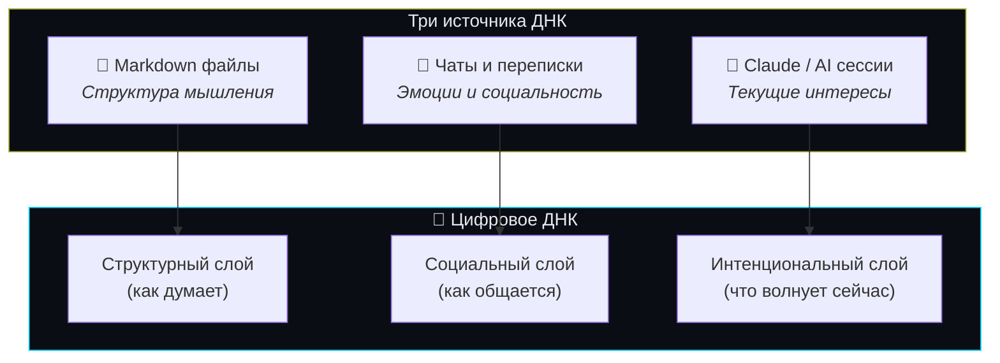
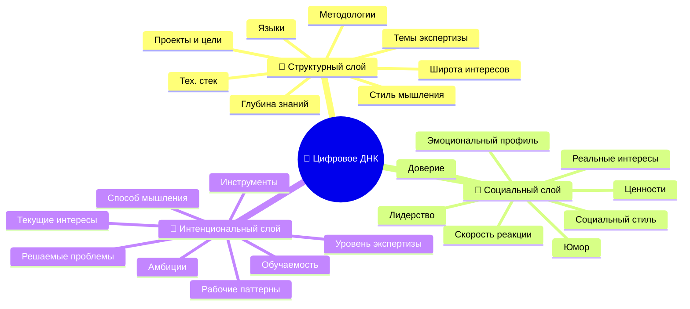

# Структура Цифрового ДНК

> Версия: 1.0 | Дата: 2026-04-09
> Связанные документы: [DIGITAL_DNA.md](DIGITAL_DNA.md), [ZK_ARCHITECTURE.md](ZK_ARCHITECTURE.md), [SDD.md](SDD.md)

---

## 1. Три источника ДНК

Цифровое ДНК складывается из трёх типов данных. Каждый тип раскрывает **разные аспекты личности**.



## 2. Компоненты ДНК по источникам

### 📁 Markdown файлы → Структурный слой

**Что раскрывают:** как человек **организует мышление**, какие темы изучает системно, какова глубина экспертизы.

| Компонент ДНК | Как извлекается | Пример |
|--------------|-----------------|--------|
| **Темы экспертизы** | TF-IDF по всем MD файлам | "distributed systems", "React", "marketing" |
| **Глубина знаний** | Длина и детализация документов по теме | 50 файлов про Python = глубокая экспертиза |
| **Широта интересов** | Количество уникальных тематических кластеров | 12 кластеров = полимат, 2 = специалист |
| **Стиль мышления** | Структура документов (списки vs проза, схемы vs текст) | Много таблиц + диаграмм = системный мыслитель |
| **Проекты и цели** | Имена директорий, заголовки планов | "revenue-map", "career-ops", "afterhumans" |
| **Технологический стек** | Упоминания технологий, фреймворков | Python, FastAPI, Docker, D3.js |
| **Языки** | Соотношение языков в файлах | 60% русский, 40% английский |
| **Методологии** | Паттерны в структуре (SDD, sprint, backlog) | Agile-ориентированный, data-driven |

**Signal quality:** ⭐⭐⭐ (средний) — много шума от библиотечных доков, но авторские файлы очень информативны.

**Вес в ДНК:** 1.0x (базовый)

---

### 💬 Чаты и переписки → Социальный слой

**Что раскрывают:** **эмоции**, реальные мнения, социальный контекст, паттерны общения, ценности.

| Компонент ДНК | Как извлекается | Пример |
|--------------|-----------------|--------|
| **Эмоциональный профиль** | Sentiment analysis сообщений | Преобладание: curiosity, enthusiasm, frustration |
| **Реальные интересы** | Темы, о которых человек ГОВОРИТ (не читает) | "Обсуждает crypto 3x чаще чем пишет о нём" |
| **Социальный стиль** | Длина сообщений, частота, инициативность | Короткие reply = интроверт; длинные = экстраверт |
| **Ценности** | О чём спорит, что защищает | "Всегда защищает privacy" → ценность: приватность |
| **Юмор** | Использование мемов, сарказма, эмодзи | Сухой юмор vs щедрые эмодзи |
| **Лидерство** | Инициирует ли разговоры, принимает ли решения | "В 80% групповых чатов первый пишет" |
| **Доверие к людям** | Насколько открыт в переписке | Делится личным vs только по делу |
| **Скорость реакции** | Время ответа в чатах | Быстрый реактор vs вдумчивый |

**Signal quality:** ⭐⭐⭐⭐⭐ (максимальный) — чаты = самые аутентичные данные о человеке.

**Вес в ДНК:** 2.0x (двойной вес)

**Privacy risk:** ВЫСОКИЙ — чаты содержат личную информацию. Требуется:
- Explicit opt-in с предупреждением
- Фильтрация PII (имена, телефоны, адреса) перед обработкой
- Пользователь выбирает какие чаты анализировать

---

### 🤖 Claude / AI сессии → Интенциональный слой

**Что раскрывают:** что человека **волнует прямо сейчас**, какие проблемы решает, как формулирует мысли.

| Компонент ДНК | Как извлекается | Пример |
|--------------|-----------------|--------|
| **Текущие интересы** | Темы последних 30 дней сессий | "Последний месяц: blockchain, protocol design" |
| **Способ мышления** | Как формулирует вопросы | Конкретные вопросы = практик; абстрактные = теоретик |
| **Уровень экспертизы** | Сложность вопросов и запросов | Beginner questions vs expert-level debugging |
| **Рабочие паттерны** | Время сессий, длительность, частота | "Работает ночью, сессии по 2-4 часа" |
| **Решаемые проблемы** | Категории запросов | Code review, architecture, content writing, research |
| **Амбиции** | Масштаб проектов в сессиях | "Строит AI corporation" vs "фиксит баги" |
| **Обучаемость** | Повторяет ли одни и те же вопросы | Не повторяет = быстро учится |
| **Инструментальность** | Какие инструменты использует через AI | Docker, Git, API, Playwright, MCP |

**Signal quality:** ⭐⭐⭐⭐ (высокий) — Claude sessions раскрывают ТЕКУЩИЕ интересы (не исторические).

**Вес в ДНК:** 3.0x (тройной вес — самый актуальный сигнал)

---

## 3. Полная карта компонентов ДНК



## 4. Пример: ДНК Тима Зинина

На основе реальных данных (9,225 md файлов + Claude sessions):

| Компонент | Значение | Источник |
|-----------|---------|---------|
| **Темы экспертизы** | AI agents, Claude Code, SMM, lead generation, content pipeline | Markdown (2,341 авторских) |
| **Тех. стек** | Python, TypeScript, Docker, FastAPI, D3.js, MCP | Markdown + Claude sessions |
| **Проекты** | СБОРКА, MCPHire, Friends, Lead-машина, Afterhumans | Директории markdown |
| **Языки** | Русский (~60%), Английский (~40%) | Markdown analysis |
| **Методологии** | SDD, Sprint Protocol, Codex Review | Structure of docs |
| **Широта** | 15+ тематических кластеров | Markdown clustering |
| **Текущий фокус** | Friends Protocol, blockchain, knowledge networking | Claude sessions (апрель 2026) |
| **Амбиции** | Строит AI corporation, протокол, несколько продуктов | Claude sessions scope |
| **Рабочие паттерны** | Ночные сессии, 2-4 часа, параллельные задачи | Session timestamps |
| **Стиль мышления** | Системный (таблицы, диаграммы, протоколы) | Document structure |

**Прогноз матчинга:** Тим матчится с людьми, которые строят AI-продукты, думают о протоколах, работают ночью, и говорят на русском/английском. Не матчится с pure frontend devs, data scientists, или людьми без собственных проектов.

## 5. Формула цифрового ДНК

```
DNA = W_struct × Structural_Vector +
      W_social × Social_Vector +
      W_intent × Intent_Vector

Где:
  W_struct = 1.0  (markdown files)
  W_social = 2.0  (chat exports)
  W_intent = 3.0  (Claude sessions)

Нормализация: DNA = normalize(DNA) → unit vector
Размерность: 768 (Phase 2) или 1024 бит Bloom (MVP)
```

## 6. Что каждый источник НЕ может раскрыть

| Аспект | Markdown | Чаты | Claude sessions |
|--------|----------|------|-----------------|
| Текущие эмоции | ❌ | ✅ | ❌ |
| Историческая экспертиза | ✅ | ❌ | ❌ |
| Реальные мнения (не публичные) | ❌ | ✅ | ❌ |
| Что волнует СЕЙЧАС | ❌ | ⚠️ Частично | ✅ |
| Социальный стиль | ❌ | ✅ | ❌ |
| Технический уровень | ✅ | ❌ | ✅ |
| Жизненные ценности | ❌ | ✅ | ❌ |
| Проекты и амбиции | ✅ | ⚠️ | ✅ |

**Вывод:** Ни один источник не даёт полной картины. **Комбинация трёх = Цифровое ДНК.** Каждый дополняет слабые стороны другого.

## 7. Связи с другими документами

- **[SDD.md](SDD.md)** → Раздел 3.2 "Источники данных" → обновить ссылкой на этот документ
- **[ZK_ARCHITECTURE.md](ZK_ARCHITECTURE.md)** → Раздел 3 "Data Ingestion" → добавить три слоя ДНК
- **[DIGITAL_DNA.md](DIGITAL_DNA.md)** → Раздел 2 "Архитектура генерации" → детализирован здесь
- **[PROTOCOL_SPEC.md](PROTOCOL_SPEC.md)** → Раздел 3 "Формат сообщений" → registration payload включает DNA type
- **[API_SPEC.md](API_SPEC.md)** → POST /register → добавить поле `dna_sources: ["markdown", "chats", "claude"]`
- **[PRODUCT_VISION.md](PRODUCT_VISION.md)** → Раздел 5 "Источники данных" → таблица обновлена
- **[expert-panel-results.md](expert-panel-results.md)** → Идея #3 (markdown), Идея #21 (Telegram), Идея #3+28 (Claude sessions)
