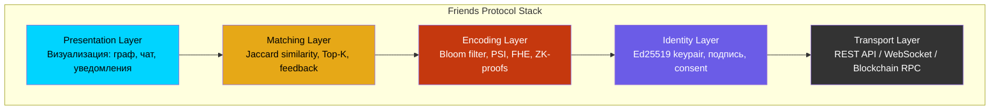
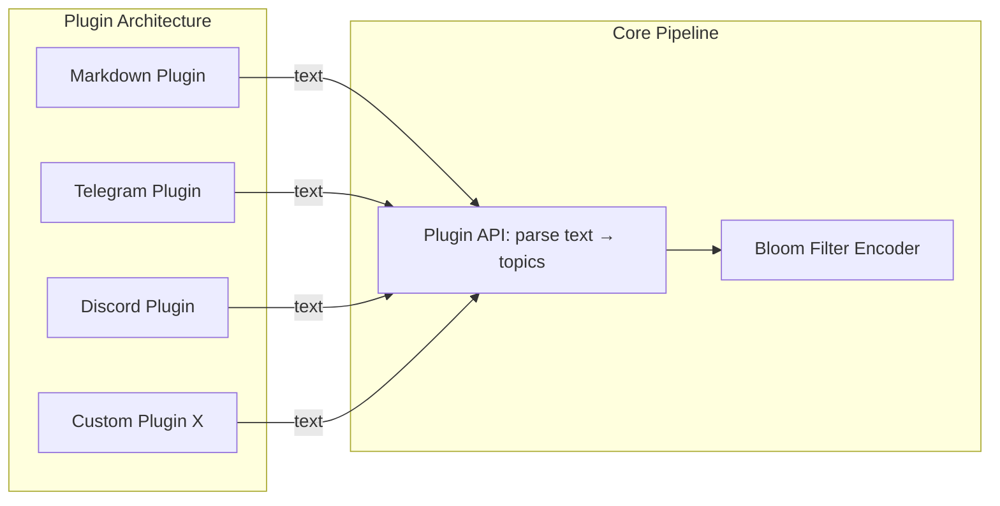

# Friends Protocol — Спецификация протокола

> Версия: 0.1.0 | Дата: 2026-04-09
> Статус: Draft для обсуждения с Денисом

---

## 1. Что такое Friends Protocol

Friends Protocol — это **открытый стандарт** для соединения людей на основе их интеллектуального отпечатка. Это не приложение, а протокол — как HTTP для веба или SMTP для почты.

> *"Можно это назвать MCP сервером или каким-то универсальным Friends протоколом коммуникации"* — Денис

Любой разработчик может создать клиент, совместимый с Friends Protocol. Matching engine может быть централизованным (MVP) или децентрализованным (blockchain, Phase 4).

## 2. Слои протокола



### Transport Layer
- **MVP:** REST API (HTTPS) + WebSocket (live updates)
- **Phase 4:** Blockchain RPC (Solana/Ethereum JSON-RPC)
- Формат: JSON
- Аутентификация: Ed25519 подпись в заголовке

### Identity Layer
- Ed25519 keypair (генерируется на клиенте)
- Public key = идентификатор пользователя
- Все мутации подписываются приватным ключом
- Consent: первая регистрация = подпись оферты

### Encoding Layer
- **v0.1:** Bloom filter (1024 bits, MurmurHash3 x 5)
- **v0.2:** Private Set Intersection (PSI)
- **v0.3:** Fully Homomorphic Encryption (FHE)
- **v1.0:** ZK-proofs on-chain

### Matching Layer
- Jaccard similarity на Bloom filters
- Top-K selection (max 20 результатов)
- Threshold: >0.15 для показа в графе
- Feedback loop: пользователь оценивает матчи → корректировка весов

### Presentation Layer
- D3.js force-directed граф (web)
- Popup с информацией о матче
- Telegram deep link для связи
- Future: мобильное приложение

## 3. Формат сообщений

### 3.1 Registration Message

```json
{
  "protocol": "friends",
  "version": "0.1.0",
  "action": "register",
  "payload": {
    "bloom_filter": "base64:AQIDBA==...",
    "public_key": "ed25519:abc123...",
    "display_name": "Alex K.",
    "telegram": "@alexk",
    "city": "Berlin",
    "data_sources": ["markdown", "claude_sessions"],
    "topic_count": 47
  },
  "signature": "ed25519:sig...",
  "timestamp": "2026-04-09T12:00:00Z"
}
```

### 3.2 Match Request

```json
{
  "protocol": "friends",
  "version": "0.1.0",
  "action": "match",
  "payload": {
    "public_key": "ed25519:abc123...",
    "max_results": 20,
    "min_similarity": 0.15,
    "city_filter": "Berlin"
  },
  "signature": "ed25519:sig...",
  "timestamp": "2026-04-09T12:00:00Z"
}
```

### 3.3 Match Response

```json
{
  "protocol": "friends",
  "version": "0.1.0",
  "action": "match_result",
  "matches": [
    {
      "public_key": "ed25519:def456...",
      "display_name": "Maria S.",
      "telegram": "@marias",
      "city": "Berlin",
      "similarity": 0.42,
      "common_topic_estimate": 12
    }
  ],
  "total_profiles": 1247,
  "query_time_ms": 8
}
```

### 3.4 Profile Update

```json
{
  "protocol": "friends",
  "version": "0.1.0",
  "action": "update",
  "payload": {
    "bloom_filter": "base64:NEWFILTER==...",
    "public_key": "ed25519:abc123...",
    "data_sources": ["markdown", "claude_sessions", "telegram_export"],
    "topic_count": 73
  },
  "signature": "ed25519:sig...",
  "timestamp": "2026-04-09T14:00:00Z"
}
```

### 3.5 Profile Deletion (GDPR Art. 17)

```json
{
  "protocol": "friends",
  "version": "0.1.0",
  "action": "delete",
  "payload": {
    "public_key": "ed25519:abc123..."
  },
  "signature": "ed25519:sig...",
  "timestamp": "2026-04-09T15:00:00Z"
}
```

## 4. Versioning

Протокол использует Semantic Versioning:
- **MAJOR** (1.0.0): breaking changes в формате сообщений
- **MINOR** (0.2.0): новые поля, обратно совместимые
- **PATCH** (0.1.1): bugfixes

Клиент ДОЛЖЕН отправлять `version` в каждом сообщении. Сервер ДОЛЖЕН поддерживать текущую + предыдущую MAJOR версию.

## 5. Extensibility: Data Source Plugins

Третьи стороны могут добавлять новые источники данных через **plugin system**:



### Plugin Interface

```typescript
interface FriendsDataPlugin {
  name: string;           // "telegram_export"
  version: string;        // "1.0.0"
  filePatterns: string[]; // ["*.json", "result.json"]

  // Парсит файл → возвращает plain text
  parse(filePath: string): Promise<string>;

  // Опционально: кастомная extraction (вместо TF-IDF)
  extractTopics?(text: string): Promise<string[]>;
}
```

## 6. Монетизация протокола

### 6.1 Protocol Fee (Phase 4, on-chain)

При децентрализации matching engine, каждый запрос матчинга оплачивается в токенах:

| Операция | Fee | Получатель |
|----------|-----|-----------|
| Register | 0.01 FRND | Protocol treasury |
| Match query | 0.001 FRND | Node operator + treasury (50/50) |
| Profile update | 0.005 FRND | Protocol treasury |
| Delete | 0 (бесплатно) | — |

### 6.2 Node Operator Rewards

Операторы matching nodes получают:
- 50% от match query fees
- Staking rewards (для обеспечения uptime)
- Slashing при downtime/manipulation

### 6.3 Premium API (Phase 2-3, centralized)

| Tier | Цена | Лимиты |
|------|------|--------|
| Free | $0 | 10 match queries/день, 1 profile |
| Pro | $5/мес | Unlimited queries, verified badge |
| Enterprise | $20/seat в мес | Team matching, API access, analytics |
| Event | $2/участник | Conference matching, temporary profiles |

### 6.4 IP-защита через протокол

Протокол защищён комбинацией:
1. **BSL лицензия** — коммерческое использование требует лицензии
2. **Trademark** — "Friends Protocol" зарегистрирован
3. **Protocol fees** — даже если кто-то форкнет код, он не сможет подключиться к основной сети без fee
4. **Network effect** — ценность = количество пользователей, форк начинает с нуля

## 7. Совместимость

### MCP (Model Context Protocol)
Friends Protocol работает поверх MCP — стандартного протокола для AI tool communication:
- Скилл → MCP → REST API → Matching Engine
- Совместимость: Claude Code, Cursor, Windsurf, любой MCP-клиент

### Будущие транспорты
- **gRPC** — для высоконагруженных клиентов
- **GraphQL** — для гибких запросов
- **Blockchain RPC** — для on-chain операций

## 8. Governance

### Текущая (Phase 1-3): Benevolent Dictator
- Tim + Denis принимают все решения
- RFC process для крупных изменений

### Будущая (Phase 4): DAO
- Token holders голосуют за изменения протокола
- Multisig treasury для protocol fees
- Grants для разработчиков экосистемы
