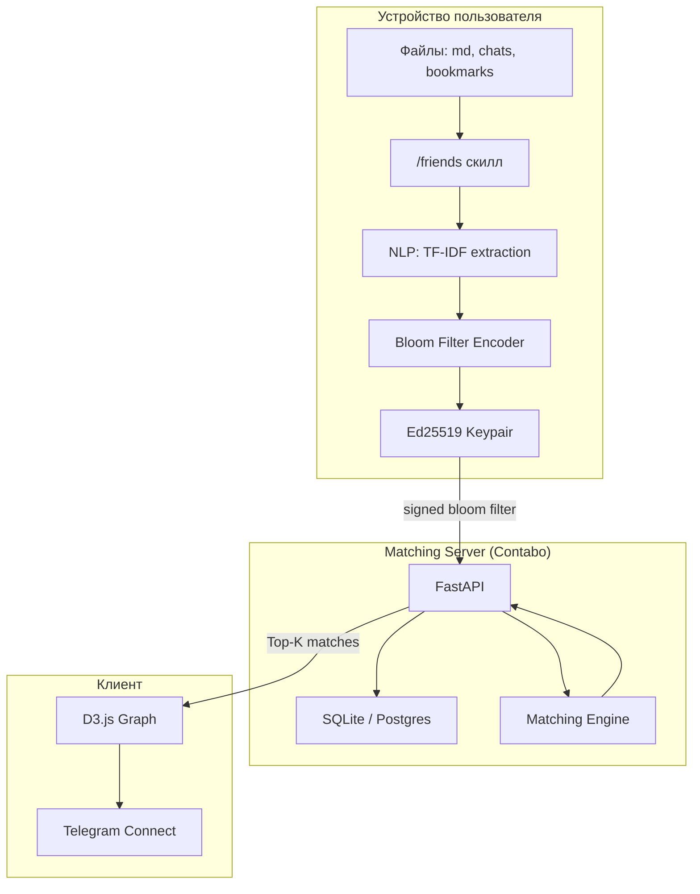

# Friends Protocol — System Design Document (SDD)

> Версия: 1.0 | Дата: 2026-04-09
> Статус: Draft для обсуждения с Денисом
> Авторы: Тим Зинин, Денис Говорунов
> Источник: Standard Recording 10 + Expert Panel (7 экспертов, 35 идей)

---

## 1. Резюме

**Friends Protocol** — открытый протокол нетворкинга по знаниям. Соединяет людей по интеллектуальному отпечатку, а не по фотографиям или анкетам. Данные обрабатываются на устройстве пользователя (zero-knowledge). Matching engine получает только необратимое представление (Bloom filter). Распространяется как Claude Code скилл через GitHub.

**Ключевые решения:**
- Networking, не dating (меньше регуляций, шире аудитория)
- Bloom filter вместо embeddings (реально privacy-preserving)
- Протокол, не приложение (третьи стороны строят поверх)
- Блокчейн — следующая фаза, не MVP

## 2. Видение и проблема

### Проблема
Люди хотят находить единомышленников, но существующие платформы оптимизированы под engagement (время в приложении), а не под качество связей. Результат: поверхностные контакты, дискриминация по внешности, утечки личных данных.

### Видение
> *"Найди друга, о котором ты не знал"*

Мир, где каждый может найти людей, чьё мышление резонирует с его собственным — без раскрытия личных данных, без посредников, без алгоритмов, оптимизированных под рекламу.

## 3. Функциональные требования

### FR-1: Сбор данных (клиент)
- Скилл сканирует markdown-файлы с явного разрешения пользователя
- Поддержка дополнительных источников: Telegram export, Discord, Slack, Notion, закладки браузера
- Произвольные текстовые файлы через unified pipeline
- Геолокация (opt-in, city-level)

### FR-2: Кодирование (клиент)
- Извлечение тем через TF-IDF (MVP) или локальную LLM (Phase 2)
- Кодирование в Bloom filter (1024 бит, MurmurHash3 x 5)
- Подпись Ed25519

### FR-3: Matching (сервер)
- Jaccard similarity на Bloom filters
- Top-K (max 20) с threshold >0.15
- Feedback loop: thumbs up/down корректирует веса (Phase 2)

### FR-4: Визуализация
- Интерактивный D3.js force-directed граф
- Клик на узел → информация + Telegram link
- Responsive (desktop + mobile)

### FR-5: Identity
- Ed25519 keypair генерируется на клиенте
- Только владелец ключа может обновить/удалить профиль
- GDPR: право на удаление через DELETE /profile

### FR-6: Коммуникация
- После матча — связь через Telegram (deep link)
- Conversation starter: общая тема для начала диалога (Phase 2)

## 4. Нефункциональные требования

| Требование | Значение | Примечание |
|-----------|---------|-----------|
| Латентность matching | <100ms при 10K users | Bloom filter comparison = O(n) |
| Доступность | 99.5% uptime | Contabo VPS, Docker restart policy |
| Масштаб MVP | 1,000 пользователей | SQLite, single server |
| Масштаб Phase 2 | 10,000 пользователей | Postgres, возможно LSH indexing |
| Масштаб Phase 3 | 100,000 пользователей | Horizontal scaling, sharding |
| Bloom filter размер | 128 байт (1024 бит) | Фиксированный для всех |
| API response time | <200ms p95 | Включая network |
| Data retention | До DELETE запроса | GDPR compliant |

## 5. Архитектура системы

## 6. Технологический стек

| Компонент | Технология | Почему |
|-----------|-----------|--------|
| Скилл | TypeScript (Claude Code native) | Нативная интеграция с MCP |
| NLP (MVP) | TF-IDF (jieba/nltk) | Лёгкий, 0 зависимостей |
| NLP (Phase 2) | Ollama + Llama 3 | Лучшее качество, локально |
| Bloom filter | Чистый JS/Python | 0 зависимостей |
| Identity | Ed25519 (tweetnacl-js) | Стандарт, маленький, быстрый |
| Сервер | FastAPI (Python) | Быстрый, async, typed |
| БД (MVP) | SQLite | Простота, 0 настройки |
| БД (Phase 2) | PostgreSQL | Масштабирование |
| Визуализация | D3.js v7 | Стандарт для графов |
| Лендинг | Статический HTML/JS | GitHub Pages, 0 стоимость |
| Хостинг | Contabo VPS 30 | Уже оплачен |
| CI/CD | GitHub Actions | Бесплатно для public repos |

## 7. Фазы развития

### Phase 1: MVP (Апрель-Май 2026)
**Gate criteria для входа:** Документация готова, ревью Дениса пройдено
- Лендинг с графом ✅
- SDD документация ← в работе
- Claude Code скилл (markdown only)
- Centralized server (FastAPI + SQLite)
- 30-50 alpha-пользователей
- **Gate для Phase 2:** ≥20 installs, ≥3 "match surprised me" отзыва

### Phase 2: Alpha (Июнь-Август 2026)
**Gate criteria:** Phase 1 gates пройдены
- Расширенные источники (Telegram, Discord, Slack exports)
- Feedback loop (thumbs up/down)
- Event matching (первый revenue)
- Multi-agent support (Cursor, Windsurf)
- Proximity matching (city-level)
- **Gate для Phase 3:** ≥500 users, первый revenue

### Phase 3: Protocol (Сентябрь-Декабрь 2026)
**Gate criteria:** Phase 2 gates пройдены
- Open-source Friends Protocol спец
- Third-party клиенты
- PSI вместо Bloom filters
- Postgres + масштабирование
- **Gate для Phase 4:** ≥5,000 users, $5K MRR, юридический ревью лицензии

### Phase 4: Decentralization (2027+)
**Gate criteria:** Phase 3 gates пройдены, юридический ревью
- Смарт-контракты (identity, consent)
- Token economics (protocol fees)
- Node operators
- DAO governance

## 8. Стоимостная модель

| Масштаб | Инфра | Стоимость/мес | Cost per user |
|---------|-------|--------------|---------------|
| 100 users | Contabo VPS 30 (уже оплачен) | ~$0 (included) | $0 |
| 1,000 users | Contabo VPS 30 | ~$0 | $0 |
| 10,000 users | Contabo + Postgres | ~$20 | $0.002 |
| 100,000 users | 3x VPS + managed Postgres | ~$200 | $0.002 |

Bloom filter storage: 128 bytes × 100K users = 12.8 MB. Matching: CPU-bound, не storage.

## 9. Ссылки на детальные документы

| Документ | Описание |
|---------|---------|
| [PRODUCT_VISION.md](PRODUCT_VISION.md) | Видение, персоны, конкуренты, фазы |
| [ZK_ARCHITECTURE.md](ZK_ARCHITECTURE.md) | Zero-Knowledge архитектура, Bloom filters, PSI, FHE roadmap |
| [PROTOCOL_SPEC.md](PROTOCOL_SPEC.md) | Слои протокола, формат сообщений, extensibility |
| [API_SPEC.md](API_SPEC.md) | REST эндпоинты, схемы запросов/ответов |
| [BLOCKCHAIN_ROADMAP.md](BLOCKCHAIN_ROADMAP.md) | Блокчейн фазы, смарт-контракты, токеномика |
| [LICENSING.md](LICENSING.md) | BSL лицензия, IP-защита, trademark |
| [SECURITY.md](SECURITY.md) | Модель угроз, GDPR compliance |
| [launch-strategy.md](launch-strategy.md) | GTM план, 5 фаз, каналы |
| [expert-panel-results.md](expert-panel-results.md) | 35 идей из брейншторма, экспертная оценка |
| [origin-transcript.md](origin-transcript.md) | Оригинальная транскрипция разговора |
