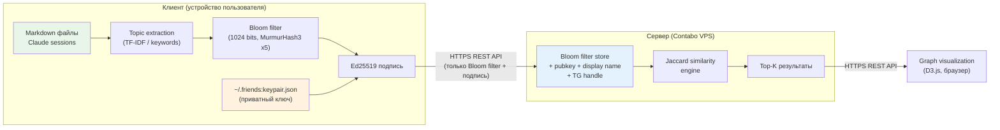
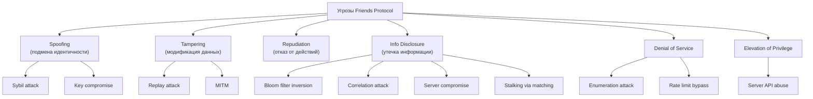
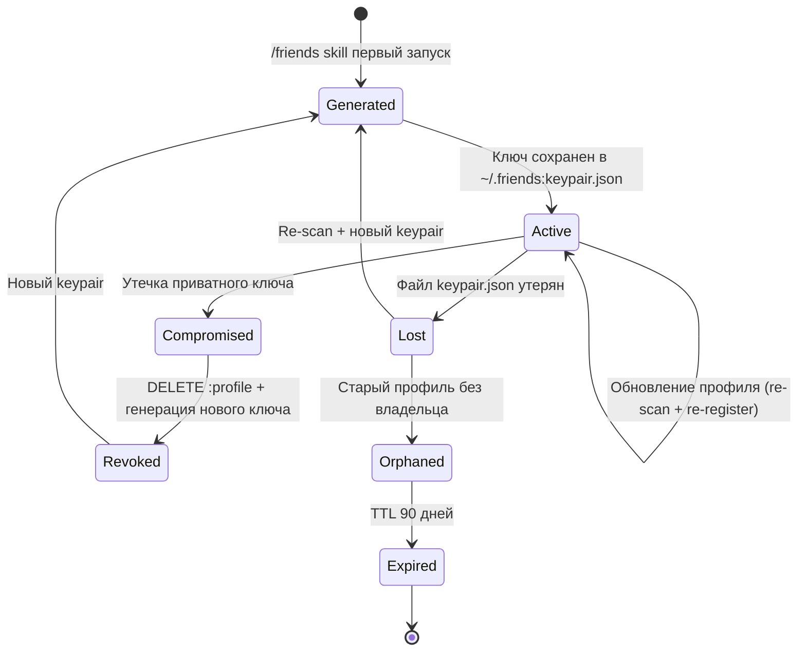

# Friends -- Модель угроз и безопасность

> Status: DRAFT v1.0
> Date: 2026-04-08
> Связанные документы: [SDD.md](SDD.md) | [Launch Strategy](launch-strategy.md)

## Содержание

1. [Архитектура безопасности](#1-архитектура-безопасности)
2. [Модель угроз](#2-модель-угроз)
3. [Процедура управления ключами](#3-процедура-управления-ключами)
4. [GDPR Compliance Matrix](#4-gdpr-compliance-matrix)
5. [Параметры Bloom filter](#5-параметры-bloom-filter)
6. [Rate Limiting](#6-rate-limiting)
7. [Рекомендации по аудиту](#7-рекомендации-по-аудиту)

---

## 1. Архитектура безопасности

### 1.1 Обзор потоков данных



### 1.2 Границы доверия

| Граница | Что пересекает | Что НЕ пересекает |
|---------|---------------|-------------------|
| Клиент --> Сервер | Bloom filter, Ed25519 pubkey, подпись, display name, TG handle | Файлы, темы, ключевые слова, приватный ключ, embeddings |
| Сервер --> Клиент | Top-K матчи (pubkey + similarity score + display name + TG handle) | Bloom filters других пользователей (не передаются), сырые данные |
| Файловая система --> Skill | Содержимое markdown файлов | Файлы не кешируются и не логируются skill'ом |

### 1.3 Принцип минимальных данных

Сервер **физически не может** восстановить темы пользователя, потому что:
1. Bloom filter -- необратимая структура данных (one-way encoding)
2. Сервер не имеет словаря тем для brute-force проверки
3. Одна и та же комбинация битов может соответствовать разным наборам тем (false positives by design)

---

## 2. Модель угроз

### 2.1 Классификация по STRIDE



### 2.2 Таблица угроз

| # | Угроза | Описание | Вероятность | Импакт | Митигация |
|---|--------|----------|-------------|--------|-----------|
| T1 | **Инверсия Bloom filter** | Атакующий получает Bloom filter и пытается восстановить исходные темы через dictionary attack -- перебирает возможные темы и проверяет, какие совпадают с установленными битами | Низкая | Средний | При 1024 битах и 5 хеш-функциях с >20 темами восстановление вычислительно нецелесообразно. Атакующему нужен словарь всех возможных тем, а каждая гипотеза дает ложные срабатывания. При 50 темах ~180 бит установлено -- коллизии делают однозначную инверсию невозможной. Дополнительно: добавление 10-20 случайных "шумовых" бит (Phase 2) |
| T2 | **Correlation attack** | Атакующий сравнивает два Bloom filter, чтобы определить общие темы. Зная свой набор тем и видя пересечение фильтров, может вывести темы жертвы | Средняя | Средний | Jaccard similarity возвращается только как скалярное число (0.0-1.0), чужие Bloom filters НЕ передаются клиенту. Атакующий видит только score, не сам фильтр. При server compromise -- см. T7 |
| T3 | **Sybil attack** | Создание множества фейковых профилей для: (a) манипуляции результатами матчинга, (b) перебора тем через correlation, (c) спама пользователей через TG handle | Средняя | Высокий | Rate limiting на :register (1 req:час на IP). Phase 2: proof-of-work при регистрации (hashcash, ~1 сек CPU). Phase 3: опциональная верификация через Telegram Bot (anti-sybil without KYC) |
| T4 | **Key compromise** | Утечка приватного ключа из `~/.friends:keypair.json` -- атакующий может обновлять или удалять профиль жертвы | Низкая | Высокий | Ключ хранится с permissions 600 (только владелец). Skill проверяет permissions при каждом запуске. Phase 2: key rotation endpoint (новый ключ подписывается старым). При обнаружении компрометации: DELETE :profile старым ключом, регистрация нового |
| T5 | **Key loss** | Потеря приватного ключа (переустановка ОС, смена устройства) = невозможность обновить или удалить профиль | Средняя | Средний | Re-scan файлов, генерация нового keypair, re-register. Старый профиль становится "orphaned" и удаляется через TTL (90 дней без обновления). Phase 2: опциональный encrypted backup. Нет master recovery -- by design, это privacy feature |
| T6 | **MITM (Man-in-the-Middle)** | Перехват трафика между клиентом и сервером: чтение Bloom filter, подмена результатов матчинга | Низкая | Средний | Обязательный HTTPS (TLS 1.3). Skill отклоняет HTTP-соединения. Ed25519 подпись запроса предотвращает подмену payload даже при компрометации TLS. Certificate pinning в Phase 2 |
| T7 | **Server compromise** | Взлом сервера: доступ к базе Bloom filters, pubkeys, TG handles | Низкая | Высокий | Bloom filters не содержат сырых данных -- атакующий получает только не-инвертируемые битовые массивы. TG handles -- единственное "чувствительное" поле, но оно публичное по природе. Базу шифровать at rest (AES-256). Мониторинг: fail2ban, Docker isolation, регулярный аудит |
| T8 | **Enumeration attack** | Перебор всех профилей через :match с разными Bloom filters для построения полной карты сети | Средняя | Средний | Rate limiting: 10 req:мин на pubkey. Top-K возвращает максимум 10 результатов. Не возвращает полный список пользователей. Минимальный порог similarity (>0.1) -- случайные фильтры не дают матчей |
| T9 | **Stalking via matching** | Атакующий знает примерные интересы жертвы, создает Bloom filter с этими темами, находит жертву в матчах по высокому similarity score | Средняя | Высокий | Top-K не возвращает 100% match (cap similarity в ответе при >0.9). Display name опциональный. TG handle видимость -- Phase 2: показывать только при mutual interest (оба в top-K друг друга). Phase 3: k-anonymity (ответ содержит минимум K результатов) |
| T10 | **Replay attack** | Повторная отправка ранее перехваченного запроса для регистрации/обновления чужого профиля | Низкая | Низкий | Каждый запрос содержит timestamp в подписываемом payload. Сервер отклоняет запросы старше 5 минут. Nonce (Phase 2) для полной защиты от replay |

### 2.3 Матрица рисков

```
           Импакт
           Высокий │ T3 Sybil    T4 Key     T9 Stalking
                   │              compromise
           Средний │ T1 Inversion T2 Corr.   T7 Server
                   │              T5 Key loss T8 Enum.
           Низкий  │              T6 MITM    T10 Replay
                   └──────────────────────────────────────
                     Низкая       Средняя     Высокая
                              Вероятность
```

---

## 3. Процедура управления ключами

### 3.1 Жизненный цикл ключей



### 3.2 Генерация ключей

```
1. Skill проверяет наличие ~/.friends:keypair.json
2. Если отсутствует:
   a. Генерирует Ed25519 keypair (crypto.generateKeyPairSync)
   b. Сохраняет в ~/.friends:keypair.json (permissions 0600)
   c. Выводит pubkey fingerprint пользователю
3. Если существует:
   a. Проверяет permissions (предупреждение если != 0600)
   b. Загружает keypair для подписи
```

### 3.3 Потеря ключа

| Шаг | Действие | Результат |
|-----|----------|-----------|
| 1 | Пользователь запускает скилл friends | Skill не находит keypair.json |
| 2 | Генерация нового keypair | Новая пара ключей в keypair.json |
| 3 | Re-scan файлов | Новый Bloom filter из текущих файлов |
| 4 | POST :register | Новый профиль с новым pubkey |
| 5 | Старый профиль | Становится "orphaned" (нет владельца с ключом) |
| 6 | TTL expiration | Сервер удаляет orphaned профили через 90 дней |

**By design:** master recovery отсутствует. Это сознательное решение в пользу приватности -- никакой третьей стороны, которая может восстановить доступ к профилю.

### 3.4 Компрометация ключа

```
1. Пользователь подозревает утечку ключа
2. DELETE :profile (подписывает скомпрометированным ключом)
3. Удалить ~/.friends:keypair.json
4. Запустить /friends заново → новый keypair + re-register
5. Если атакующий успел сменить ключ:
   → Обратиться к администратору с proof of ownership (подписанный challenge)
   → Phase 2: key rotation endpoint (новый ключ подписывается старым)
```

### 3.5 Бэкап ключей (Phase 2)

- Опциональный encrypted backup: `keypair.json` шифруется passphrase (AES-256-GCM) и сохраняется в облако (iCloud / Google Drive)
- Пользователь выбирает: удобство восстановления vs. дополнительный attack surface
- По умолчанию: бэкап выключен (privacy-first)

---

## 4. GDPR Compliance Matrix

Friends обрабатывает минимум персональных данных. Bloom filter не содержит персональных данных в прямом смысле (не инвертируется), но pubkey + TG handle + display name являются идентификаторами.

| Статья GDPR | Требование | Реализация в Friends |
|-------------|-----------|---------------------|
| **Art. 5(1)(c)** | Минимизация данных | Сервер хранит ТОЛЬКО Bloom filter + pubkey + display name + TG handle. Сырые данные (файлы, темы, текст) никогда не покидают устройство |
| **Art. 6(1)(a)** | Законное основание обработки -- согласие | Явный opt-in: пользователь сам запускает скилл friends и подтверждает сканирование файлов. Согласие криптографически зафиксировано подписью Ed25519 |
| **Art. 7** | Условия согласия | Согласие: (a) свободное -- skill опциональный, (b) конкретное -- только markdown файлы, (c) информированное -- skill выводит описание перед сканированием, (d) отзываемое -- DELETE :profile в любой момент |
| **Art. 13-14** | Прозрачность обработки | Privacy policy в составе документации (docs/SECURITY.md). Skill выводит краткое описание при первом запуске. Полная архитектура в SDD.md (open source) |
| **Art. 15** | Право доступа | `GET :profile/{pubkey}` -- пользователь получает все данные, хранящиеся на сервере: Bloom filter, display name, TG handle, дата регистрации, дата последнего обновления |
| **Art. 16** | Право на исправление | `PUT :profile` -- обновление Bloom filter, display name, TG handle в любое время (подписанный запрос) |
| **Art. 17** | Право на удаление (забвение) | `DELETE :profile` -- полное удаление профиля с сервера. Подписывается Ed25519. Необратимо. TTL 90 дней для orphaned профилей -- автоматическое удаление |
| **Art. 20** | Портативность данных | `GET :profile/{pubkey}` возвращает Bloom filter в стандартном формате (base64-encoded). Пользователь может экспортировать и перенести на другой совместимый сервер |
| **Art. 25** | Privacy by design / by default | Вся обработка данных -- на устройстве клиента. Сервер получает только Bloom filter. Не собираются: IP-адреса (кроме rate limiting в памяти), user agents, cookies. Никаких трекеров |
| **Art. 32** | Меры безопасности | HTTPS (TLS 1.3), Ed25519 подписи, Bloom filter encoding, rate limiting, fail2ban, Docker isolation, шифрование БД at rest (Phase 2) |
| **Art. 33-34** | Уведомление о нарушении | В случае компрометации сервера: notify через Telegram всех зарегистрированных пользователей (TG handle). Bloom filters не содержат PII, поэтому фактический ущерб минимален |

### 4.1 Что НЕ является персональными данными в контексте Friends

| Элемент | Персональные данные? | Обоснование |
|---------|---------------------|-------------|
| Bloom filter | Нет (pseudo-anonymous) | Не инвертируется в исходные данные. Не является прямым или косвенным идентификатором |
| Ed25519 public key | Да (псевдоним) | Однозначно идентифицирует профиль, хотя не привязан к реальной личности |
| Display name | Зависит | Если содержит реальное имя -- да. Если псевдоним -- нет |
| Telegram handle | Да | Привязан к реальному аккаунту Telegram |

---

## 5. Параметры Bloom filter

### 5.1 Выбранная конфигурация (MVP)

| Параметр | Значение | Обоснование |
|----------|---------|-------------|
| Размер фильтра (m) | 1024 бит (128 байт) | Баланс между privacy (больше коллизий = сложнее инверсия) и matching quality (меньше false positives) |
| Количество хеш-функций (k) | 5 (MurmurHash3 variants) | Оптимум для m=1024 и n~50 элементов. k = (m/n) * ln(2) = (1024/50) * 0.693 = 14.2 -- мы используем 5, сознательно увеличивая FPR ради privacy |
| Хеш-функция | MurmurHash3 (128-bit) | Быстрая, хорошее распределение, не криптографическая (достаточно для Bloom filter) |
| Ожидаемое число элементов (n) | 20-100 тем на пользователя | Типичный диапазон для активного пользователя Claude Code |

### 5.2 False Positive Rate (FPR)

Формула: `FPR = (1 - e^(-kn/m))^k`

| Тем (n) | Установленных бит (прибл.) | FPR | Качество матчинга |
|---------|---------------------------|-----|-------------------|
| 10 | ~49 (4.8%) | ~0.07% | Отличное, но мало данных для матчинга |
| 20 | ~93 (9.1%) | ~0.5% | Хорошее |
| 50 | ~216 (21.1%) | ~3.5% | Приемлемое -- оптимальная точка |
| 100 | ~387 (37.8%) | ~18.7% | Фильтр перенасыщен, качество падает |
| 150 | ~510 (49.8%) | ~41.2% | Неприемлемое -- нужен больший фильтр |

### 5.3 Устойчивость к инверсии

**Сценарий атаки:** атакующий имеет Bloom filter (1024 бит) и словарь из D возможных тем. Для каждой темы вычисляет 5 хешей и проверяет, все ли биты установлены.

| Параметр | Значение |
|----------|---------|
| Размер словаря (D) | 10,000 возможных тем |
| Тем в фильтре (n) | 50 |
| FPR на одну тему | ~3.5% |
| Ложных положительных на словарь | ~350 тем |
| Реальных тем | 50 |
| **Соотношение шум/сигнал** | **7:1** (350 ложных на 50 реальных) |

При 50 темах и словаре 10K тем атакующий получит ~400 "совпадений", из которых только 50 реальные. Без дополнительной информации невозможно отделить реальные темы от ложных.

**Усиление (Phase 2):** добавление 10-20 "шумовых" случайных бит при каждой генерации фильтра дополнительно размывает сигнал.

### 5.4 Рекомендации

- При >100 темах: предупреждать пользователя о снижении privacy (фильтр перенасыщен)
- При <10 темах: предупреждать о малом количестве данных для матчинга
- Оптимальный диапазон: **20-80 тем**
- Phase 3: динамический размер фильтра (2048 бит для power users) с миграцией

---

## 6. Rate Limiting

### 6.1 Конфигурация

| Endpoint | Лимит | Ключ лимита | Обоснование |
|----------|-------|-------------|-------------|
| `POST :register` | 1 req:час | IP-адрес | Защита от Sybil attack. Легитимный пользователь регистрируется один раз |
| `PUT :profile` | 5 req:час | pubkey | Защита от частых обновлений для correlation attack |
| `POST :match` | 10 req:мин | pubkey | Основной рабочий endpoint. 10 req:мин достаточно для UX, но ограничивает enumeration |
| `GET :profile/{pubkey}` | 5 req:мин | pubkey | Защита от скрапинга профилей |
| `DELETE :profile` | 3 req:час | pubkey | Защита от DoS на удаление чужих профилей |

### 6.2 Реализация

```
Механизм: sliding window counter (Redis или in-memory dict)
Ответ при превышении: HTTP 429 Too Many Requests
Заголовки: Retry-After, X-RateLimit-Remaining, X-RateLimit-Reset
Логирование: WARNING при 80% лимита, ERROR при превышении
Бан: 10+ превышений за час → IP/pubkey в blocklist на 24 часа
```

### 6.3 Защита от обхода

| Вектор обхода | Контрмера |
|---------------|-----------|
| Смена IP (VPN/proxy) | Лимит на :register по IP + proof-of-work (Phase 2) |
| Множество pubkeys | Каждый pubkey требует отдельной регистрации (1:час на IP) |
| Distributed attack | Global rate limit на сервер (1000 req:мин total) + CloudFlare (Phase 2) |

---

## 7. Рекомендации по аудиту

### 7.1 Регулярный аудит (ежемесячно)

- [ ] Проверить логи rate limiting -- есть ли паттерны enumeration
- [ ] Проверить количество orphaned профилей (TTL expiration)
- [ ] `pip-audit` на зависимости FastAPI сервера
- [ ] Проверить permissions keypair.json у test-пользователей
- [ ] Проверить TLS сертификат (expiration, grade)

### 7.2 Аудит при изменении архитектуры

- [ ] Новый endpoint -- добавлен rate limit?
- [ ] Новое поле в профиле -- обновлена GDPR matrix?
- [ ] Изменение параметров Bloom filter -- пересчитана FPR и устойчивость к инверсии?
- [ ] Новая зависимость -- проверена через `pip-audit`?

### 7.3 Инцидент-процедура

```
1. Обнаружение (мониторинг, пользователь, третья сторона)
2. Оценка scope: какие данные затронуты
3. Containment: отключение скомпрометированного endpoint/сервера
4. Уведомление пользователей через TG (Art. 33-34 GDPR, <72 часа)
5. Root cause analysis
6. Fix + deploy + verify
7. Post-mortem документ
```

---

## Приложение A: Формат подписанного запроса

```json
{
  "pubkey": "base64-encoded Ed25519 public key",
  "payload": {
    "bloom_filter": "base64-encoded 128 bytes",
    "display_name": "optional string",
    "tg_handle": "optional @username",
    "timestamp": "2026-04-08T12:00:00Z"
  },
  "signature": "base64-encoded Ed25519 signature over canonical JSON of payload"
}
```

Сервер проверяет:
1. `signature` валидна для `pubkey` и `payload`
2. `timestamp` не старше 5 минут
3. `pubkey` соответствует зарегистрированному профилю (для PUT/DELETE)

## Приложение B: Сравнение с аналогами

| Аспект | Friends | Tinder, Bumble | LinkedIn | Blockchain social |
|--------|---------|--------------|----------|-------------------|
| Данные на сервере | Bloom filter (128 байт) | Фото, био, геолокация, переписка | Полный профиль, связи, контент | Полный профиль on-chain (публичный) |
| Инверсия данных | Невозможна | N/A (данные в открытом виде) | N/A | N/A (данные публичные) |
| Удаление профиля | DELETE + TTL 90 дней | Сложное, данные остаются в бэкапах | Сложное | Невозможно (immutable ledger) |
| Идентификация | Псевдонимный pubkey | Реальное имя + фото | Реальное имя + карьера | Wallet address |
| Согласие | Криптографическое (Ed25519) | Checkbox ToS | Checkbox ToS | Implicit (транзакция) |
