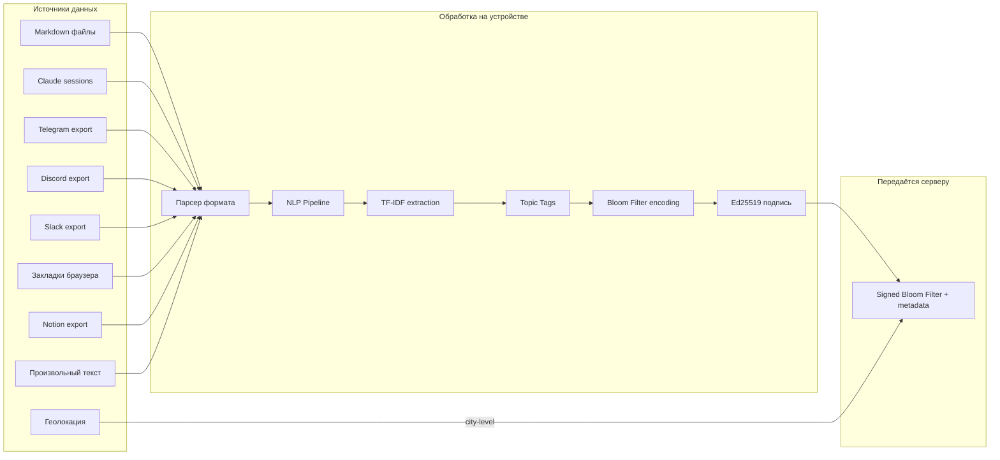
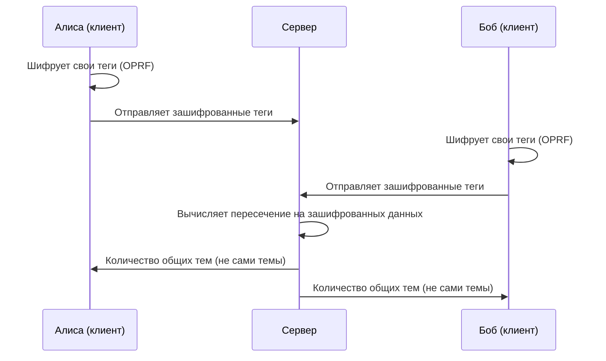
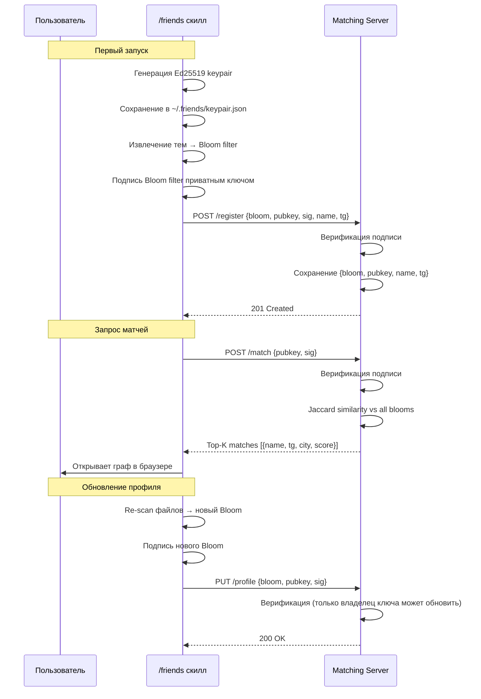

# Zero-Knowledge архитектура Friends Protocol

> Версия: 1.0 | Дата: 2026-04-09
> Статус: Спецификация для обсуждения

---

## 1. Принцип

Все данные пользователя обрабатываются **исключительно на его устройстве**. Matching engine получает только **необратимое представление** (Bloom filter) — компактный битовый массив, из которого невозможно восстановить исходные темы.

> *"Вопрос в том чтобы это было закодировано на стороне человека и никак не могло быть разгадано"* — из разговора Тим + Денис

## 2. Обзор ZK-подходов

| Подход | Описание | Сложность | Безопасность | Производительность | Для Friends |
|--------|----------|-----------|-------------|-------------------|------------|
| **Bloom filter** | Битовый массив, элементы хешируются через K функций | Низкая | Средняя (не true ZK) | Очень высокая | **MVP** |
| **Private Set Intersection (PSI)** | Два участника узнают пересечение множеств, не раскрывая остальное | Средняя | Высокая | Средняя | **Phase 2** |
| **Fully Homomorphic Encryption (FHE)** | Вычисления на зашифрованных данных | Высокая | Очень высокая | Низкая (10-1000x overhead) | Phase 3+ |
| **ZK-SNARKs** | Доказательство утверждения без раскрытия данных | Очень высокая | Максимальная | Средняя (proof generation ~seconds) | Phase 4 |
| **ZK-STARKs** | Как SNARKs, но без trusted setup | Очень высокая | Максимальная | Ниже SNARKs | Phase 4+ |

### Выбранная стратегия: Эволюционный подход

```
MVP:     Bloom filter + Ed25519     (practical privacy, 0 overhead)
Phase 2: PSI для двусторонних матчей (cryptographic privacy)
Phase 3: FHE для server-side matching (full privacy)
Phase 4: ZK-proofs on blockchain     (verifiable privacy)
```

## 3. MVP: Bloom Filter Pipeline

### 3.1 Data Ingestion — Приём данных

Скилл `/friends` принимает данные из множества источников через **unified pipeline**:



### 3.2 Парсинг форматов

| Формат | Парсер | Выход |
|--------|--------|-------|
| `*.md` | Markdown → plain text (strip headers, links, code) | Текст |
| Claude `.jsonl` | JSON → extract `assistant` + `user` content | Текст |
| Telegram JSON export | `messages[].text` | Текст |
| Discord JSON export | `messages[].content` | Текст |
| Slack export | `messages[].text` per channel | Текст |
| Browser bookmarks HTML | Parse `<a>` tags → URL titles | Текст |
| Notion `.md` export | Markdown → plain text | Текст |
| Произвольный `.txt` | Прямо текст | Текст |

**Принцип:** Все форматы конвертируются в plain text → единый NLP pipeline.

### 3.3 NLP Pipeline (на устройстве)

```
Текст
  ↓
Токенизация (пробелы + пунктуация)
  ↓
Удаление стоп-слов (EN/RU)
  ↓
Лемматизация (опционально, Phase 2)
  ↓
TF-IDF scoring (term frequency × inverse document frequency)
  ↓
Top-N тегов (N = 50-100 по TF-IDF весу)
  ↓
Нормализация (lowercase, dedupe)
  ↓
Topic Tags: ["distributed systems", "rust", "category theory", ...]
```

**Лёгкий вариант (MVP):** keyword extraction без LLM. Регулярные выражения + TF-IDF. Работает на любом устройстве за <5 секунд.

**Продвинутый вариант (Phase 2):** Локальная LLM (Llama 3 via Ollama) для семантического извлечения тем. Лучшее качество, но требует ~8GB RAM.

### 3.4 Bloom Filter Encoding

**Параметры:**
- Размер: **1024 бита** (128 байт)
- Hash-функции: **5** (MurmurHash3 с разными seed)
- Ожидаемое количество элементов: **50-100 тегов**
- False positive rate: **~3.5%** при 50 элементах

**Процесс:**
```python
# Псевдокод
bloom = BitArray(1024)  # 1024 бита, все 0

for tag in topic_tags:
    for seed in [0, 1, 2, 3, 4]:  # 5 hash-функций
        index = murmurhash3(tag, seed) % 1024
        bloom[index] = 1

# Результат: 128 байт, необратимый
```

**Свойства:**
- Невозможно восстановить исходные теги из Bloom filter (one-way)
- Можно проверить "этот тег ВОЗМОЖНО есть" или "этого тега ТОЧНО нет"
- Jaccard similarity на двух Bloom filters ≈ Jaccard similarity на исходных множествах

### 3.5 Что передаётся серверу

```json
{
  "bloom_filter": "base64_encoded_128_bytes",
  "public_key": "ed25519_public_key_hex",
  "display_name": "Alex K.",
  "telegram": "@alexk",
  "city": "Berlin",
  "signature": "ed25519_signature_of_bloom_filter",
  "protocol_version": "0.1.0"
}
```

### 3.6 Что НИКОГДА не покидает устройство

| Данные | Передаётся? | Почему |
|--------|-------------|--------|
| Исходные файлы (markdown, чаты) | **НИКОГДА** | Core privacy principle |
| Извлечённый текст | **НИКОГДА** | Промежуточный этап |
| Topic tags (слова) | **НИКОГДА** | Читаемые данные |
| Приватный ключ Ed25519 | **НИКОГДА** | Идентичность |
| Bloom filter | ДА (зашифрован) | Необратимое представление |
| Display name | ДА (opt-in) | Пользователь решает |
| Telegram handle | ДА (opt-in) | Пользователь решает |
| Город | ДА (opt-in, city-level) | Для proximity matching |

## 4. Matching Algorithm

### 4.1 Jaccard Similarity на Bloom Filters

```
similarity(A, B) = |A ∩ B| / |A ∪ B|

Для Bloom filters:
  A ∩ B = bitwise AND(A, B)
  A ∪ B = bitwise OR(A, B)

  similarity = popcount(A AND B) / popcount(A OR B)
```

**Интерпретация:**
- 0.0 = нет общих тем
- 0.1-0.2 = слабое сходство
- 0.2-0.4 = среднее (есть общие интересы)
- 0.4-0.6 = сильное (много общего)
- 0.6+ = очень сильное (почти идентичные интересы)

**Порог для матча:** >0.15 (показывать в графе)

### 4.2 Top-K Selection

```
1. Вычислить similarity(user_bloom, all_other_blooms)
2. Отсортировать по убыванию similarity
3. Вернуть Top-20 с score > 0.15
4. Для каждого: {public_key, display_name, telegram, city, score}
```

**Производительность:**
- 1K пользователей: <10ms (1024 бит × 1000 = ~128KB, всё в RAM)
- 10K пользователей: <100ms
- 100K пользователей: ~1s (нужен индекс, LSH — Phase 3)

## 5. Phase 2: Private Set Intersection (PSI)

**Зачем:** Bloom filters дают "приблизительное" сходство. PSI даёт **точное** пересечение тем без раскрытия остальных.

**Как работает:**


**Библиотеки:** OpenMined PySyft, MP-SPDZ, Microsoft SEAL

**Когда переходить:** >1K пользователей + спрос на "точные" матчи

## 6. Phase 3-4: Fully Homomorphic Encryption & ZK-Proofs

### FHE (Phase 3)
- Сервер вычисляет similarity **на зашифрованных данных**
- Никогда не видит даже Bloom filter в открытом виде
- Overhead: 100-1000x медленнее, но hardware accelerators улучшаются
- Библиотеки: Microsoft SEAL, TFHE-rs (Rust), Concrete (Zama)

### ZK-Proofs (Phase 4, on-chain)
- Пользователь доказывает "мой профиль содержит ≥N тем из категории X" **без раскрытия тем**
- Smart contract верифицирует proof
- Используется для: verified expertise, trust scoring, reputation
- Фреймворки: Circom, Noir (Aztec), SP1 (Succinct)

## 7. Архитектура Ed25519 Identity



## 8. Восстановление при потере ключа

| Сценарий | Действие |
|----------|---------|
| Потеря устройства | Re-scan файлов на новом устройстве → новый keypair → новый профиль. Старый профиль orphaned (не удаляется, т.к. нет приватного ключа). |
| Смена устройства | Копирование `~/.friends/keypair.json` на новое устройство |
| Backup | Опциональное шифрование keypair паролем + хранение в облаке (Phase 2) |
| Нет master recovery | **By design** — это privacy feature. Никто, включая нас, не может получить доступ к чужому профилю. |

## 9. Сравнительная таблица подходов

| Критерий | Bloom Filter (MVP) | PSI (Phase 2) | FHE (Phase 3) | ZK-proofs (Phase 4) |
|----------|-------------------|---------------|---------------|---------------------|
| **Приватность** | Средняя (correlation attacks возможны) | Высокая | Очень высокая | Максимальная |
| **Сложность реализации** | 1 день | 2-4 недели | 2-3 месяца | 3-6 месяцев |
| **Производительность** | <10ms/query | ~100ms/query | ~10s/query | ~1s proof gen |
| **Зависимости** | 0 (чистый JS/Python) | PySyft, MP-SPDZ | Microsoft SEAL | Circom/Noir |
| **Требования к клиенту** | Минимальные | Средние | Средние | Высокие (proof gen) |
| **True Zero-Knowledge?** | Нет (heuristic privacy) | Частично | Да | Да |
| **Blockchain-ready?** | Нет | Нет | Частично | Да |
