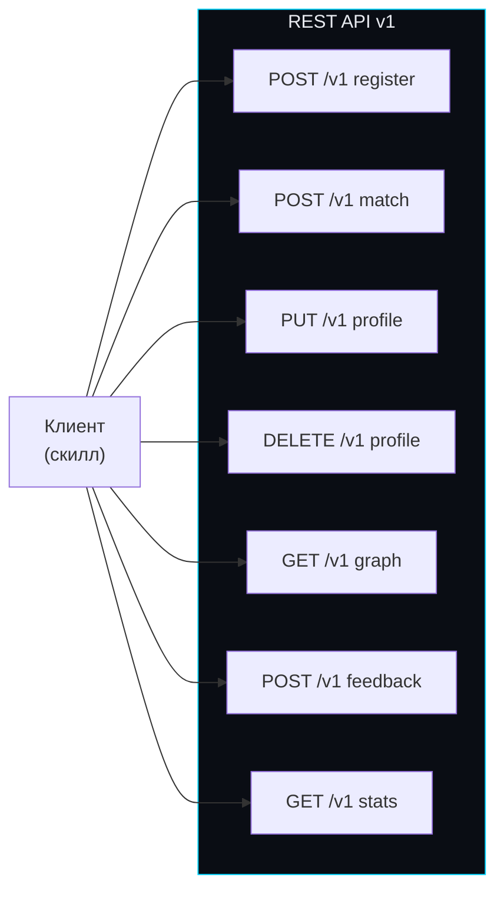
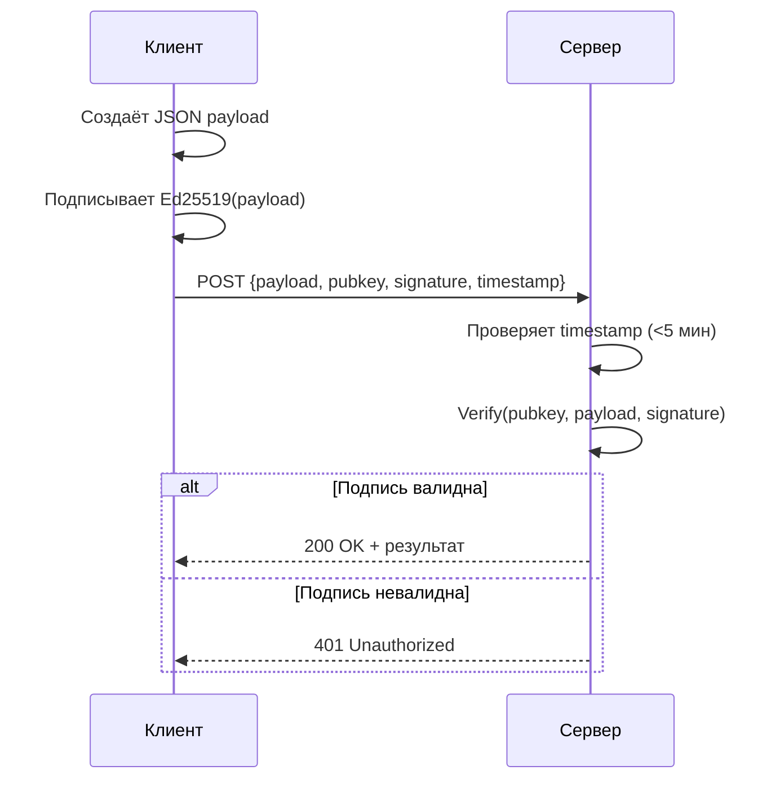

# API Reference

## Endpoints

## Обзор

| Метод | Эндпоинт | Описание | Auth | Rate Limit |
|-------|----------|---------|------|-----------|
| POST | /v1 register | Регистрация профиля | Ed25519 sig | 1 per hour per IP |
| POST | /v1 match | Запрос матчей | Ed25519 sig | 10 per min per pubkey |
| PUT | /v1 profile | Обновление профиля | Ed25519 sig | 5 per min per pubkey |
| DELETE | /v1 profile | Удаление (GDPR) | Ed25519 sig | 1 per day per pubkey |
| GET | /v1 graph | Граф для визуализации | pubkey param | 30 per min per pubkey |
| POST | /v1 feedback | Оценка матча (Phase 2) | Ed25519 sig | 20 per min |
| GET | /v1 stats | Публичная статистика | нет | 60 per min per IP |

## Аутентификация

## Полная спецификация

Детальные схемы запросов и ответов — в [docs/API_SPEC.md](../blob/main/docs/API_SPEC.md)
