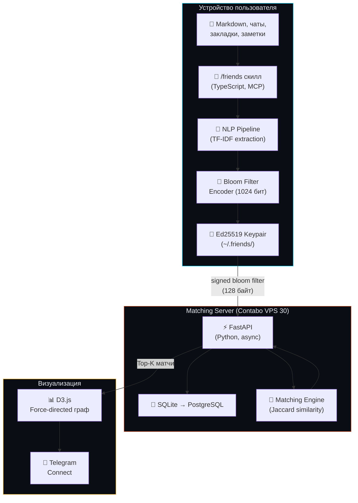
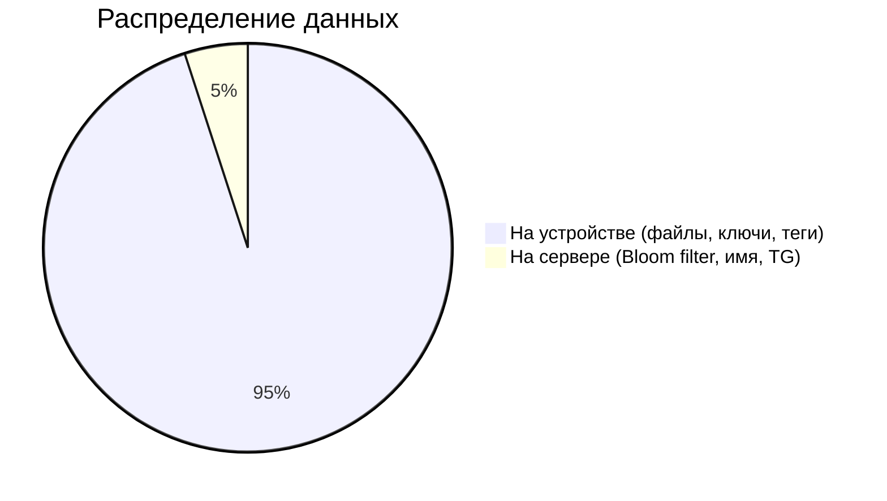
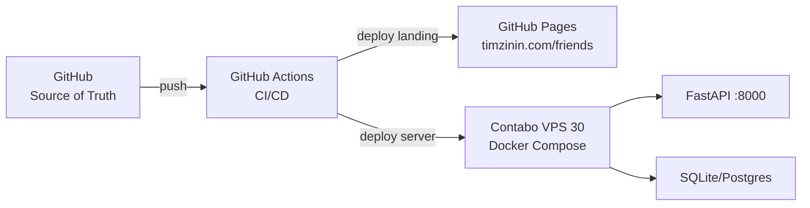

# Архитектура системы

## Общая архитектура

## Что где хранится

## Технологический стек

| Компонент | Технология | Фаза |
|-----------|-----------|------|
| Скилл | TypeScript + MCP | MVP |
| NLP | TF-IDF (MVP), Ollama + Llama 3 (Phase 2) | MVP |
| Encoding | Bloom filter 1024 бит, MurmurHash3 x 5 | MVP |
| Identity | Ed25519 (tweetnacl-js) | MVP |
| Сервер | FastAPI (Python) | MVP |
| БД | SQLite → PostgreSQL | MVP → Phase 2 |
| Визуализация | D3.js v7 force-directed | MVP |
| Лендинг | Static HTML на GitHub Pages | MVP |
| Блокчейн | Solana или Base (L2) | Phase 4 |

## Deployment

