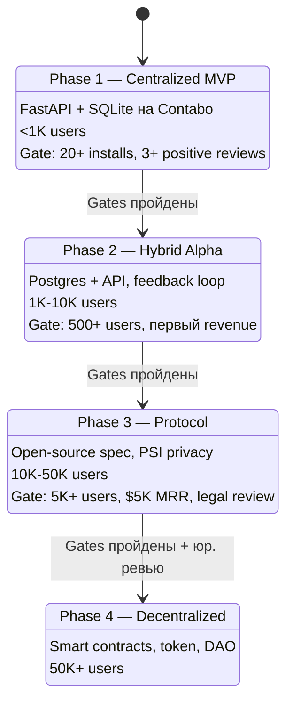
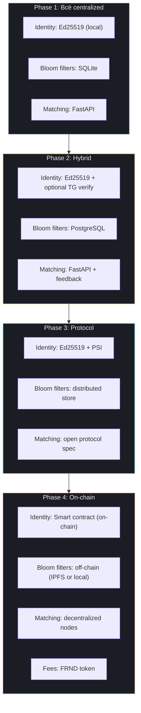
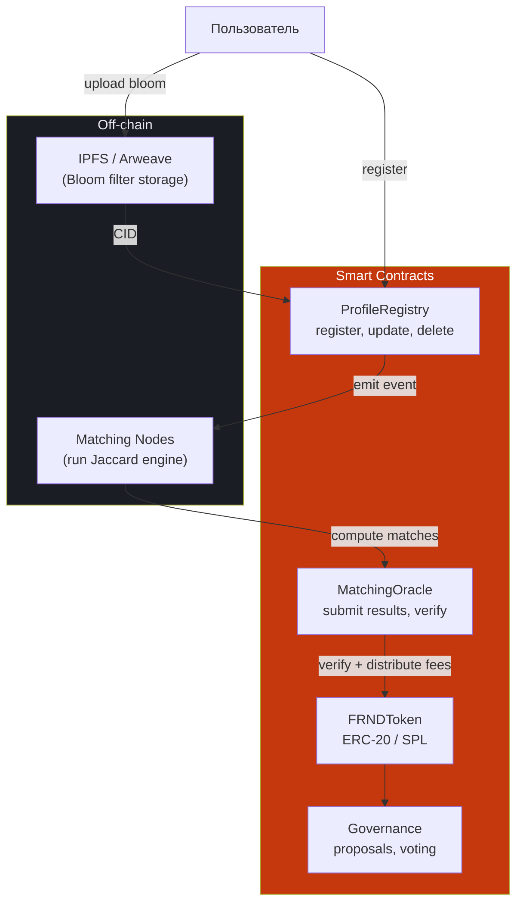

# Фазы децентрализации

## State Diagram

## Что когда переходит на блокчейн

## Сравнение блокчейнов

| Критерий | Solana | Base (Ethereum L2) | Sui |
|----------|--------|-------------------|-----|
| TPS | ~65,000 | ~2,000 | ~120,000 |
| Стоимость tx | $0.00025 | $0.001-0.01 | $0.001 |
| Язык контрактов | Rust (Anchor) | Solidity | Move |
| Экосистема DeFi | Большая | Растущая (Coinbase) | Средняя |
| Время финализации | ~400ms | ~2s | ~400ms |
| **Наш выбор** | **Рекомендован** | Альтернатива | Запасной |

## Smart Contract архитектура (Phase 4)

## Токеномика FRND (если будет)

| Аллокация | % |
|-----------|---|
| Community и airdrops | 40% |
| Team (Тим + Денис) | 20% |
| Node operators | 20% |
| Treasury | 15% |
| Early contributors | 5% |
