# Friends Protocol

> Открытый протокол нетворкинга по знаниям. Соединяет людей по тому, как они думают — не по фотографиям.

## Навигация

| Страница | Описание |
|---------|---------|
| [[Architecture]] | Системная архитектура |
| [[ZK Pipeline]] | Zero-Knowledge pipeline обработки данных |
| [[Matching Algorithm]] | Алгоритм матчинга (Jaccard, Bloom) |
| [[Blockchain Phases]] | Фазы децентрализации |
| [[Protocol Layers]] | Слои протокола |
| [[API]] | REST API эндпоинты |
| [[Changelog]] | История изменений |

## Ключевые документы (в репо)

- [SDD.md](../blob/main/docs/SDD.md) — System Design Document v1.0
- [PRODUCT_VISION.md](../blob/main/docs/PRODUCT_VISION.md) — Видение продукта
- [ZK_ARCHITECTURE.md](../blob/main/docs/ZK_ARCHITECTURE.md) — Zero-Knowledge архитектура
- [PROTOCOL_SPEC.md](../blob/main/docs/PROTOCOL_SPEC.md) — Спецификация протокола
- [BLOCKCHAIN_ROADMAP.md](../blob/main/docs/BLOCKCHAIN_ROADMAP.md) — Блокчейн дорожная карта
- [SECURITY.md](../blob/main/docs/SECURITY.md) — Модель угроз
- [API_SPEC.md](../blob/main/docs/API_SPEC.md) — Спецификация API

## Принцип работы

```mermaid
flowchart LR
    A[Установи /friends] --> B[Скилл читает файлы]
    B --> C[Извлекает темы]
    C --> D[Кодирует в Bloom filter]
    D --> E[Отправляет на сервер]
    E --> F[Получает матчи]
    F --> G[Видишь граф]
    G --> H[Связываешься в TG]

    style A fill:#00D4FF,color:#000
    style D fill:#c5380e,color:#fff
    style G fill:#e6a817,color:#000
```

## Статус

- ✅ Лендинг: [timzinin.com/friends](https://timzinin.com/friends/)
- ✅ Документация: SDD v1.0
- 🔧 В разработке: Claude Code скилл
- 📋 Планируется: Matching server
