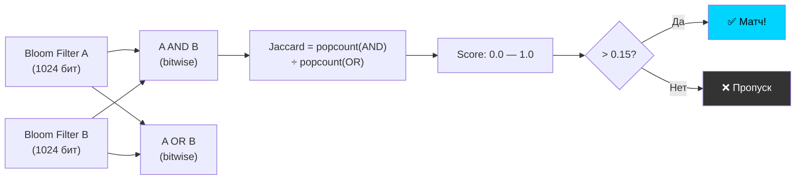
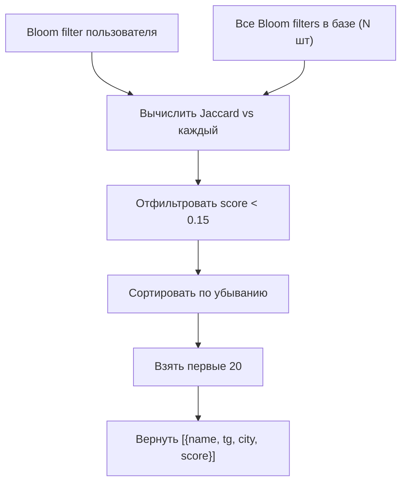
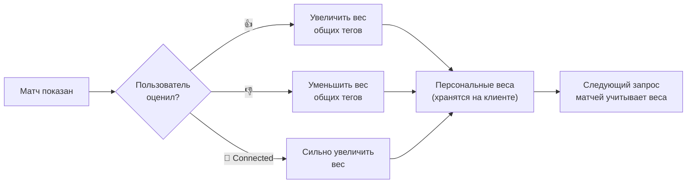

# Алгоритм матчинга

## Jaccard Similarity на Bloom Filters



## Формула

```
similarity(A, B) = |A ∩ B| / |A ∪ B|

Для Bloom filters:
  intersection = bitwise_AND(A, B)
  union        = bitwise_OR(A, B)
  similarity   = popcount(intersection) / popcount(union)
```

## Интерпретация

| Score | Значение | Действие |
|-------|---------|---------|
| 0.00 — 0.10 | Нет общих тем | Не показывать |
| 0.10 — 0.15 | Минимальное сходство | Не показывать (ниже threshold) |
| 0.15 — 0.25 | Есть общие интересы | Показать в графе (далёкий узел) |
| 0.25 — 0.40 | Среднее сходство | Показать (средний узел) |
| 0.40 — 0.60 | Сильное сходство | Показать рядом (близкий узел) |
| 0.60 + | Очень похожие | Выделить особо |

## Top-K Selection



## Производительность

| Масштаб | Bloom filters в RAM | Время матчинга | Подход |
|---------|-------------------|----------------|--------|
| 100 users | 12.8 KB | <1ms | Linear scan |
| 1,000 users | 128 KB | <10ms | Linear scan |
| 10,000 users | 1.28 MB | <100ms | Linear scan |
| 100,000 users | 12.8 MB | ~1s | LSH (Locality-Sensitive Hashing) |
| 1,000,000 users | 128 MB | ~100ms с LSH | LSH + sharding |

## Feedback Loop (Phase 2)


