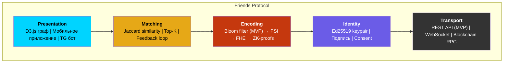
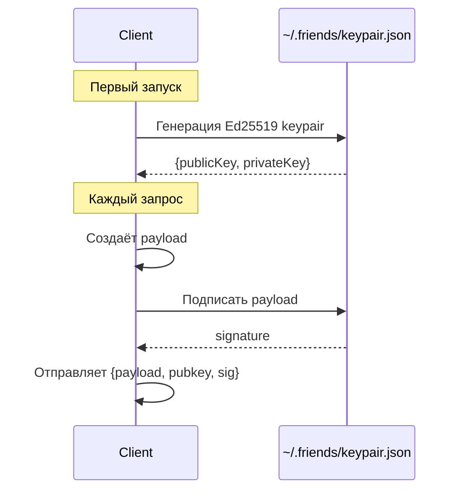
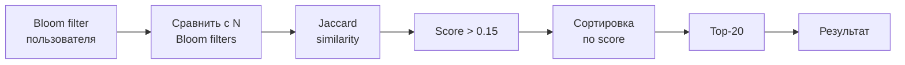
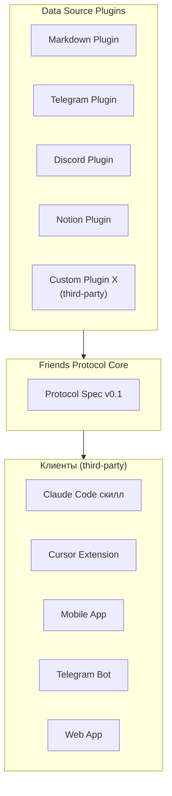

# Слои протокола

## Friends Protocol Stack

## Детализация каждого слоя

### L1: Transport
Отвечает за передачу данных между клиентом и сервером.

| Фаза | Транспорт | Описание |
|------|-----------|---------|
| MVP | REST API (HTTPS) | Простой, проверенный |
| Phase 2 | + WebSocket | Real-time уведомления |
| Phase 4 | + Blockchain RPC | On-chain операции |

### L2: Identity
Управляет идентичностью пользователя.

### L3: Encoding
Преобразует данные пользователя в privacy-preserving представление.

| Подход | Фаза | Что передаётся | Обратимость |
|--------|------|----------------|-------------|
| Bloom filter | MVP | 128 байт bit array | Нет (heuristic) |
| PSI | Phase 2 | Зашифрованные множества | Нет (crypto) |
| FHE | Phase 3 | Fully encrypted data | Нет (math) |
| ZK-proofs | Phase 4 | Zero-knowledge proof | Нет (proven) |

### L4: Matching
Вычисляет сходство между профилями.

### L5: Presentation
Визуализация результатов.

- **MVP:** D3.js force-directed граф в браузере
- **Phase 2:** + push-уведомления о новых матчах
- **Phase 3:** + мобильное приложение (React Native)
- **Phase 4:** + Telegram бот для быстрого доступа

## Extensibility

Любой разработчик может создать:
1. **Data Source Plugin** — новый источник данных (реализует интерфейс `FriendsDataPlugin`)
2. **Client** — новый клиент поверх Friends Protocol (использует REST API)
3. **Matching Node** — свой node для децентрализованного матчинга (Phase 4)
