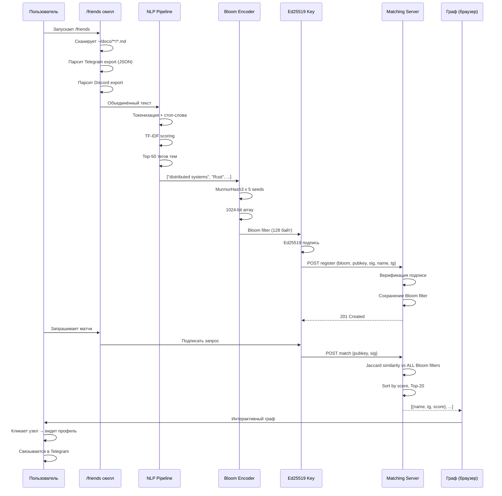
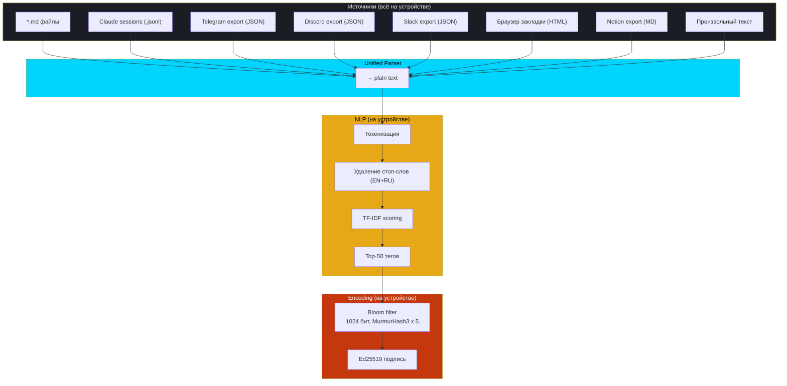
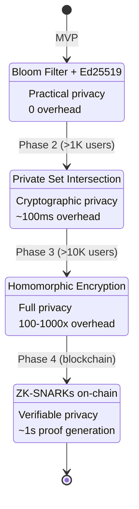

# ZK Pipeline — Обработка данных

## Полный pipeline от файлов до матча



## Источники данных и парсинг



## Bloom Filter: визуализация

```
Тег "distributed systems" → hash(seed=0) = 142, hash(seed=1) = 587, ...

Bit array (1024 бит):
[0 0 0 ... 1 ... 0 0 0 ... 1 ... 0 0 0 ...]
              ↑ bit 142        ↑ bit 587

50 тегов × 5 hash функций = ~250 бит установлены из 1024
False positive rate: ~3.5%
```

## Эволюция приватности


